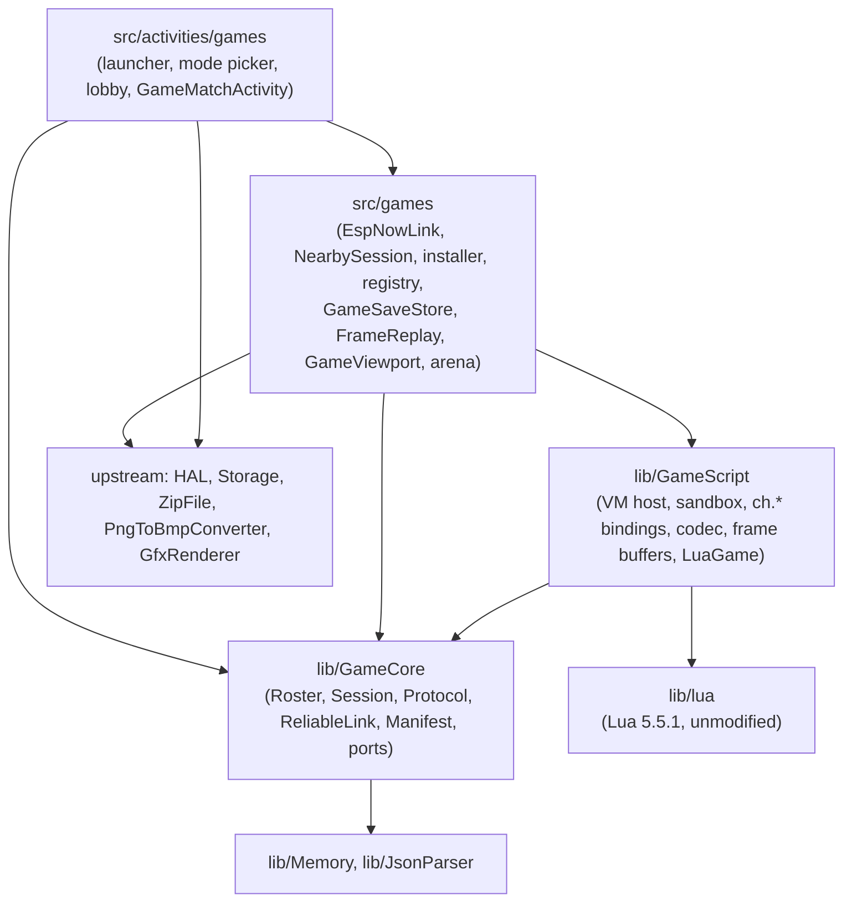
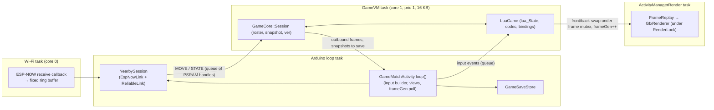

# Architecture Spine: crosshatch-player v1 game platform

## Design Paradigm

**Hexagonal host.** `lib/GameCore` is the domain: roster, session, turns, snapshots, the wire protocol, the reliable link, and manifests. It is host-testable C++20 with no device dependencies. It declares ports; everything touching Lua, the radio, the SD card, or the display is an adapter outside it.

**Reducer contract for scripts.** A game is a set of functions over one serializable `state`. Only the **authority** device runs `setup` and `apply`. Every device runs `draw` and `input`. The runtime replicates the whole state after each move, so scripts contain no radio code and one script runs in every mode.

| Layer | Lives in | May depend on |
| --- | --- | --- |
| Domain | `lib/GameCore/` | C++ standard library, `lib/Memory`, `lib/JsonParser` |
| Script adapter | `lib/GameScript/` | `GameCore`, `lib/lua` |
| Engine (vendored) | `lib/lua/` | C standard library |
| Device adapters | `src/games/` | `GameCore`, `GameScript`, HAL, `Storage`, `ZipFile`, `PngToBmpConverter`, ESP-NOW, mbedTLS |
| Screens | `src/activities/games/` | `src/games/`, `GameCore`, `GfxRenderer`, `UiListActivity` / `UiAppHost` |

## Invariants & Rules



Arrows are the only allowed dependencies. `GameCore` includes no Arduino, ESP-IDF, Lua, HAL, or `src/` header. `GameScript` includes no `GfxRenderer`, HAL, or Arduino header; platform services reach it through injected ports.

### AD-1: Hexagonal host, reducer scripts [ASSUMPTION]

- **Binds:** all
- **Prevents:** game rules or radio logic split between C++ and Lua; a core that only runs on the device.
- **Rule:** game logic lives only in scripts. Roster, session, turn, sync, and protocol logic lives only in `GameCore`, behind the ports `IGameRules`, `ILink`, `IClock`, `IRandom`, and `ISnapshotStore`. Adapters implement ports and hold no game rules. Every `GameCore` unit has a host GoogleTest suite; link and session suites run over a `FakeLink` that drops, delays, duplicates, and reorders frames.

### AD-2: One build guard, C3-safe [ASSUMPTION]

- **Binds:** all
- **Prevents:** game code costing flash or RAM on C3 builds, or breaking them.
- **Rule:** `FREEINK_CAP_GAMES=1` is set in `platformio.ini` `build_flags` for `x4pro`, `sticky`, and their `-gh_release` / `-gh_release_rc` variants only. Every include of game code in an upstream file sits inside `#if FREEINK_CAP_GAMES`. Every `.cpp` under `src/games/` and `src/activities/games/` is wrapped whole-file in `#if FREEINK_CAP_GAMES`. `lib/Game*` has no namespace-scope objects with non-trivial constructors and no static buffers over 64 B. All game libraries compile, unreferenced, for `default`, `x4c`, and `papermono`.

### AD-3: The upstream-touch ledger is the cap [ADOPTED]

- **Binds:** all
- **Prevents:** the fork drifting back into CrossPlay's merge pain.
- **Rule:** v1 changes only the upstream files in the ledger below, plus at most 1 reserve file, which must be added to the ledger in the same PR. Each change is `#if FREEINK_CAP_GAMES`-guarded where the language allows; unguardable changes are marked as such. The ledger lives in `docs/crosshatch/upstream-touches.md`, and a fork-only CI job fails any PR that changes an upstream file not on it. Anything beyond the reserve needs a spine update first.

  | # | Upstream file | Change | Guarded |
  | --- | --- | --- | --- |
  | 1 | `platformio.ini` | `FREEINK_CAP_GAMES=1` in the six x4pro/sticky envs | env-scoped |
  | 2 | `lib/I18n/translations/english.yaml` | `STR_GAMES_*` keys appended | append-only |
  | 3 | `test/CMakeLists.txt` | `add_subdirectory(game_core)`, `add_subdirectory(game_script)` | no |
  | 4 | `src/activities/ActivityManager.h` | `HomeMenuItem::Games`, `goToGames()` | yes |
  | 5 | `src/activities/ActivityManager.cpp` | `goHome` mapping, `goToGames()` | yes |
  | 6 | `src/activities/home/HomeActivity.h` | index mapping, `onGamesOpen()` | yes |
  | 7 | `src/activities/home/HomeActivity.cpp` | item count, switch case, label and icon | yes |
  | 8 | `src/components/CoverGridHomeUi.h` | tab array size | yes |
  | 9 | `src/components/CoverGridHomeUi.cpp` | Games icon entry | yes |

  The vendored engine is kept out of the whole-tree format check by a new `lib/lua/.clang-format` with `DisableFormat: true`, not by editing `bin/clang-format-fix`.

### AD-4: Lua 5.5.1, unmodified, 64-bit integers [ADOPTED]

- **Binds:** script-runtime, api-docs, first-party-games
- **Prevents:** a patched engine that blocks upgrades; games or saves that depend on a language level or integer width that later changes.
- **Rule:** PUC Lua 5.5.1 is vendored byte-for-byte in `lib/lua/` and compiled as C, with every `LUA_COMPAT_*` option off. `io`, `os`, `debug`, `package`, `coroutine`, `linit`, and the standalone binaries are excluded. Games target the Lua 5.5 language (`global` is reserved; `for` control variables are read-only) with 64-bit integers; `LUA_32BITS` can only arrive with a new `api` level and a `proto` bump. `lua_newstate`'s hash seed comes from `IRandom`. Every C++ file that includes `lua.h` includes `<climits>` first and `static_assert`s `sizeof(lua_Integer) == 8`. Before API level 1 freezes, the spike harness is re-run once on 5.5.1 with a worst-case C-stack test (deep patterns, deep parser nesting); only a measured regression reverts the pin to 5.4.9.

### AD-5: The VM task owns the Lua state and nothing else [ASSUMPTION]

- **Binds:** script-runtime, multiplayer-layer
- **Prevents:** two tasks entering one `lua_State`; a teardown deadlock on `RenderLock` (pitfall 12cc816); a hung script freezing the device.
- **Rule:**
  - At most one game VM exists. A dedicated `GameVM` task (priority 1, core 1, 16 KB stack) creates, calls, and destroys it; `GameCore::Session` is confined to the same task. No other task calls the Lua API.
  - The `GameVM` task never takes `RenderLock`, never calls `ActivityManager`, and never touches `Storage`. It exchanges work with the match activity through depth-bounded queues that carry handles to PSRAM buffers, not frame copies; a full input queue drops the oldest event with a log line.
  - The match activity holds a `HalPowerManager::Lock` while a callback is running, so budgets are measured at full clock.
  - Stopping is cooperative: the match sets an atomic cancel flag that the count hook turns into a Lua error, and posts `Quit`. The VM task unwinds, closes the state, and signals a join semaphore. If the join has not happened 500 ms after cancel (a script stuck inside a C library call), the match **abandons** the VM: it deletes the task and frees the VM's arena without calling `lua_close`.
  - A cancel yields the outcome `Cancelled`, which is distinct from `ScriptError` and never triggers AD-14.

### AD-6: Sandbox and budgets [ADOPTED from the spike, amended]

- **Binds:** script-runtime
- **Prevents:** a game crashing the device, starving internal RAM, or running forever.
- **Rule:**
  - Each VM's heap is one 256 KB PSRAM arena managed by a small in-tree allocator behind a counting `lua_Alloc`. `src/games` supplies the arena backend as a port. Abandoning a VM (AD-5) frees the arena in one call.
  - Every entry into the VM, including script load and setup, goes through a `lua_pcall` trampoline.
  - A sticky count hook enforces 2 M instructions per callback. A script's own `pcall` cannot swallow the budget error.
  - Libraries: base (without `load`, `loadfile`, `dofile`; `print` maps to `ch.log`), table, string, math, utf8. `require` is replaced by the package-jailed loader (AD-15).
  - Every chunk is loaded in text mode (`"t"`); binary chunks are rejected at install and at load.
  - `math.random` is seeded from `IRandom` (backed by `esp_random()`) when the VM is created.
  - Bindings are C-style functions. No binding holds an RAII object across a call into Lua, and no binding opens files.

### AD-7: Drawing is a display list; FrameReplay owns refresh [ASSUMPTION]

- **Binds:** script-runtime, first-party-games
- **Prevents:** Lua touching the framebuffer from the wrong task; lost or doubled refresh escalations; taps landing away from what was drawn.
- **Rule:**
  - `ch.gfx.*` appends commands to a back frame buffer in PSRAM (at most 2,048 commands / 32 KB; overflow is a script error). Calling `ch.gfx` outside `draw` is a script error.
  - When `draw` returns, the VM task swaps front and back buffers under a frame mutex and bumps an atomic `frameGen`. The match activity's `loop()` polls `frameGen` and calls `requestUpdate()`. The render task takes the frame mutex only inside `render()`. Lock order is always `RenderLock`, then the frame mutex.
  - The runtime calls `draw` after every new snapshot, after every `input` call, and after hand-off or resume. There is no periodic tick in v1. A frame identical to the one on screen is not refreshed.
  - `FrameReplay` is the only escalation policy. Its inputs are the frame's hint (`fast`, `half`, `full`), a `forceFull` flag set by the match activity, and its own fast-refresh counter. Coalesced frames keep the maximum hint (`full` > `half` > `fast`). v1 refreshes whole frames; dirty-region refresh is deferred.
  - Color: fills take `white`, `light`, `dark`, `black` (`light` and `dark` render as dithered fills); lines and text take `white` or `black` only. Text sizes are `small`, `medium`, `large`. Script code never names panel sizes or firmware font IDs.
  - One `GameViewport` in `src/games` defines the script canvas (rotation, offset, the size exposed as `ch.screen`, excluded bezel insets). `FrameReplay` (logical to panel) and the input builder (panel to logical) both use it. The script owns the whole canvas; the runtime draws over it only with its own views (AD-20).

### AD-8: The game contract [ASSUMPTION]

- **Binds:** script-runtime, multiplayer-layer, first-party-games, api-docs
- **Prevents:** games that each invent their own lifecycle, turn signalling, or rejection handling.
- **Rule:** `main.lua` returns a table with exactly these entry points:

  | Function | Runs on | Returns |
  | --- | --- | --- |
  | `setup(ctx)` | authority | the initial `state`; `ctx = {seats = n, mode = "solo" \| "pass" \| "nearby"}` |
  | `status(state)` | authority; any device inside `draw` | `{turn = seat}` or `{over = true, winners = {seat…}}`; must be a pure function of `state` |
  | `apply(state, seat, move)` | authority | the new `state`, or `nil, reason` to reject |
  | `draw(state, seat, ui)` | every device | nothing; draws via `ch.gfx` |
  | `input(state, seat, ui, event)` | every device | a `move`, or `nil` |

  - `ui` is a table per local seat (one per seat in `pass`, one in `solo` and `nearby`). The script may mutate it freely; it is never synced or saved.
  - A rejected move (by `apply`, or as stale or out of turn) reaches the mover's `input` as `{kind = "rejected", reason = "…"}` in every mode. The runtime never draws the reason itself.
  - While a move is awaiting its `STATE` or `REJECT`, the runtime still calls `input` but discards any move it returns.
  - Computer opponents, if a game has one, run inside `apply`.
  - The script decides turn order through `status`; the runtime enforces it (AD-11). This is a deliberate change from the brief's "runtime owns turn order".

### AD-9: The snapshot is the source of truth [ASSUMPTION]

- **Binds:** multiplayer-layer, script-runtime
- **Prevents:** host and guest diverging; `draw` or `input` mutating game state as a side effect; two devices disagreeing on whose turn it is.
- **Rule:** the canonical state is the encoded snapshot held by `GameCore::Session` on the authority. Each `apply` receives a fresh decode of it, and its result is re-encoded to become the new snapshot. `draw`, `input`, and `status` receive a decoded copy whose changes are discarded. The authority computes `status` after each accepted move and ships it inside `STATE`; guests gate input and the end-of-round flow on that shipped status and never call `status` for control flow.

### AD-10: One codec, one size limit, every mode [ASSUMPTION]

- **Binds:** multiplayer-layer, script-runtime, first-party-games
- **Prevents:** a game that works in pass-and-play and breaks in Play Nearby; a firmware update that silently corrupts saves.
- **Rule:**
  - One C codec in `GameScript` encodes state, moves, and `ch.store`. It accepts nil, boolean, integer, float, string, and tables with string or integer keys: acyclic, depth at most 16, no metatables, functions, or userdata. Integral float keys are normalized to integers; other float keys and NaN keys are errors.
  - **Codec v1 bytes** (little-endian): one tag byte per value (`nil`, `false`, `true`, int, float, string, table); int is zigzag LEB128 of an i64; float is IEEE-754 binary64; string is a LEB128 length plus bytes; a table is `LEB128 narr`, `narr` values for keys `1..narr` (the longest non-nil run from 1), `LEB128 nrec`, then `nrec` key/value pairs. Decode inserts in stream order.
  - Limits apply to codec output: snapshot at most **1,400 B**, move at most **256 B**, `ch.store` at most **4 KB**. They are enforced in every mode, and a breach is a script error.
  - The codec version is part of `proto`. Every persisted codec blob starts with `{magic, fileVersion, codecVersion}`; an unknown version is discarded with a log line, never decoded.
  - A Python reference codec in `scripts/` and the C codec pass the same golden vectors in `test/game_script/`. The byte formats are recorded in `docs/crosshatch/formats.md`.

### AD-11: Roster, seats, and authority [ASSUMPTION]

- **Binds:** multiplayer-layer, package-install-launcher
- **Prevents:** two seat maps; a guest claiming another seat; two-player assumptions baked into the core; moves accepted out of turn.
- **Rule:** a `Roster {mode, n, localSeats, peers[seat] → link id}` is fixed before `setup` and immutable for the match, including rematches.
  - **Solo:** `n = 1`; local input is seat 1. Offered only when `seats.min == 1`.
  - **Pass:** the player picks `n` within `seats` and the host maximum; local input is `status.turn`.
  - **Nearby:** the lobby assigns seats in `ACCEPT` order, the host is seat 1, and `n` is the number of seats filled when the host starts (at least 2). The roster moves into the match with `NearbySession`.
  - The seat of a remote move comes from the peer's link identity, never from the payload.
  - A `status` naming a turn outside `1..n` is a script error. Moves are applied strictly one at a time.
  - In `pass` mode at game over, `draw` and `input` receive `seat = 0` ("everyone"), and any returned move is ignored.
  - v1 hosts support n ≤ 2; nothing in `GameCore` may assume n = 2.

### AD-12: The runtime owns the hand-off [ADOPTED from the brief, amended]

- **Binds:** multiplayer-layer
- **Prevents:** hidden information leaking through e-ink ghosting, sleep, or resume.
- **Rule:** in `pass` mode with manifest `hidden = true`:
  - After an accepted move that changes the turn seat, the mover sees the result frame with a runtime "Pass to player N" control; tapping it shows the blank hand-off screen with a full refresh, and a tap there draws the next seat.
  - The hand-off screen also comes before the first draw after `setup` and after resume.
  - The match activity's `onExit()`, including the sleep path, renders the blank hand-off screen into the framebuffer before returning, under the `RenderLock` it already holds and without taking it again.
  - Scripts cannot draw during or suppress the hand-off. In `nearby` mode each device draws only its own seat.

### AD-13: Wire protocol [ASSUMPTION]

- **Binds:** multiplayer-layer
- **Prevents:** the link and the session reading one counter two ways; mismatched payload layouts; matches between devices running different game code.
- **Rule:**
  - Frame: `{magic "XH", proto u8, type u8, session u32, seq u16, ack u16, payload}`, little-endian. `GameCore::Protocol` is the only encoder and decoder of frames and payloads.
  - `seq`/`ack` belong to `ReliableLink` alone: `seq` counts reliable frames per direction, and `ack` is cumulative. `ADVERT`, `PING`, and `ACK` are unreliable and consume no `seq`. Unacked frames are resent every 400 ms; a peer silent for 10 s is dropped.
  - Payloads:

    | Type | Payload |
    | --- | --- |
    | `ADVERT` | `gameId (len8, ≤ 32 B), pkgHash[8], manifestApi u8, seatsMax u8, seatsTaken u8, hostLabel (len8, ≤ 16 B)` |
    | `JOIN` | `pkgHash[8]` |
    | `ACCEPT` | `seat u8, n u8`, sent to every guest when the host starts |
    | `MOVE` | `ver u16, move blob` |
    | `STATE` | `ver u16, turn u8 (0 when over), over u8, winners u16 bitmask, snapshot blob` |
    | `REJECT` | `ver u16, reason (len8, ≤ 64 B)` |
    | `ABORT` | `reason u8`: `left`, `script_error`, `timeout`, `full`, `version_mismatch` |
    | `PING` | empty |

  - `ver` is owned by `Session`: it increases with every snapshot for the life of the `session` id and never resets, including on rematch. `STATE` is latest-wins: the link may replace an unacked `STATE` with a newer one, and a guest ignores any `STATE` whose `ver` is not newer than its own.
  - The host draws the `session` id from `IRandom` when the lobby opens; frames with any other `session` are dropped. The host stops `ADVERT` when the match starts and answers a late `JOIN` with `ABORT(full)`.
  - Matching requires equal `proto` (which includes the codec version) and equal package hash. The firmware `api` level is not compared.
  - Only `ADVERT` is broadcast. Everything else is unicast to a peer registered on the STA interface. ESP-NOW v2, fixed channel 1, no encryption.

### AD-14: A script failure ends the session [ASSUMPTION]

- **Binds:** script-runtime, multiplayer-layer
- **Prevents:** half-recovered VMs and inconsistent error handling across callbacks.
- **Rule:** a `ScriptError` is any Lua error, budget breach, memory cap breach, codec limit breach, frame buffer overflow, or invalid `status`. It ends the session: the VM is stopped (AD-5), a peer is sent `ABORT(script_error)`, the error is logged with `LOG_ERR`, and the match shows its error view: a short `tr()` message, the game name, the Lua message in small type, and a single Back control. There is no automatic retry. A `Cancelled` outcome shows nothing.

### AD-15: Package format and the one manifest parser [ASSUMPTION]

- **Binds:** package-install-launcher, first-party-games, api-docs
- **Prevents:** several package shapes and manifest dialects; path traversal and zip bombs; a package that installs but never lists.
- **Rule:**
  - A game is one `.cpgame` file: a zip (stored or deflate, no ZIP64) read through `lib/ZipFile`. Members are flat and whitelisted: `manifest.json`, `main.lua`, `[a-z0-9_]{1,32}.lua`, and an optional non-interlaced `icon.png`. Anything else, including directories, makes the package invalid.
  - Limits: package at most 256 KB, at most 32 members, each member at most 128 KB uncompressed. Every member's CRC is verified.
  - `require("name")` loads only `name.lua` from the package root.
  - `GameCore::Manifest::parse()` is the only manifest parser; the installer, registry, launcher, and lobby all call it. `Manifest::check(hostCaps)` returns `Invalid(reason)` (rejected at install), `Unavailable(reason)` (installed but not startable, e.g. `api` above the host's), or `Ok` with the modes this host can satisfy.
  - Manifest keys: `id` (matching `^[a-z0-9][a-z0-9-]{0,31}$`), `name`, `version`, `api` (integer ≥ 1), `seats {min, max}`, `modes` (non-empty, from `solo`, `pass`, `nearby`), `hidden` (default `false`). Unknown keys are ignored.

### AD-16: One installer, one registry, the SD inbox [ADOPTED]

- **Binds:** package-install-launcher
- **Prevents:** install paths that validate differently; half-installed or phantom games; reinstall deleting saves; two devices seeing different identities for the same game.
- **Rule:**
  - `GamePackageInstaller` is the only code that installs or removes games. In v1 its only entry point is the SD inbox: the launcher installs every `/games/*.cpgame` when it opens. Users put files there with the existing web file manager or USB. A web Games page is deferred; `/api/games*` is reserved for it.
  - It validates the package (AD-15), extracts to `/.games-tmp/<id>/`, removes any old `/.games/<id>/`, renames the new directory into place, and writes `.pkg` last as the commit marker. A leftover `/.games-tmp/` is deleted when the launcher opens.
  - `.pkg` holds `v1\n` followed by the 16 lowercase hex digits of the package hash and `\n`. The package hash is the first 8 bytes of a SHA-256 over the members sorted by name, each as `name \0 u32le(length) uncompressed-bytes`. `scripts/pack_game.py` computes the same value, and both pass a shared test vector. SHA-256 is reached through one helper in `src/games`.
  - The registry lists only directories under `/.games/` that have a valid `.pkg` and whose name equals `manifest.id`. There is no separate index.
  - An inbox file is deleted after a successful install. A failed file is renamed `*.cpgame.bad`, and the launcher shows the reason once.
  - Removing a game (from the launcher) deletes `/.games/<id>/` and keeps `/.games-data/<id>/`.
  - All file access goes through `Storage` / `HalFile`.

### AD-17: The runtime owns persistence [ASSUMPTION]

- **Binds:** script-runtime, multiplayer-layer, package-install-launcher
- **Prevents:** scripts writing arbitrary files; resume formats that differ between games; SD writes from the VM task or on the sleep path.
- **Rule:**
  - Scripts have no file API. `src/games/GameSaveStore` implements `ISnapshotStore` and is the only reader and writer of `/.games-data/<id>/resume.bin` and `store.bin`. It runs on the loop task and writes to a `.tmp` file, then renames.
  - `resume.bin` holds `{magic, fileVersion, codecVersion, pkgHash[8], mode, n, ver u16}` followed by the snapshot. It is written after every committed snapshot in `solo` and `pass`, never in `onExit`, and deleted when the round ends. The launcher calls `GameSaveStore::peek()` to offer "Continue". A save whose package hash or codec version differs is discarded. `nearby` matches are not saved.
  - `ch.store` is one table per game per device. `get` and `set` work in every callback; `set` validates at once (AD-10) and marks the store dirty. `GameSaveStore` writes a dirty store at most every 5 s and at round end, match exit, and sleep. Writes made in `apply` land only on the authority.

### AD-18: Radio ownership [ASSUMPTION]

- **Binds:** multiplayer-layer
- **Prevents:** ESP-NOW and the web server fighting over Wi-Fi; a radio left on after a match; GameCore running on the Wi-Fi task.
- **Rule:**
  - One `NearbySession` owns Wi-Fi and ESP-NOW. Bring-up order: `WiFi.mode(WIFI_STA)`, set channel 1, wait for STA start, `ESP_NOW.begin`, register peers on the STA interface.
  - The ESP-NOW receive callback only copies frames into a fixed ring buffer in `EspNowLink`; it calls no `GameCore` code.
  - The lobby creates the session and passes it by move into `GameMatchActivity`'s constructor, switching with Replace; a moved-from lobby tears down nothing. It never coexists with the web server or any other Wi-Fi activity.
  - The lobby and a `nearby` match set `preventAutoSleep`.
  - Teardown never takes `RenderLock`. If internal heap does not recover after teardown, leaving the match to Home may `silentRestart()`; nothing restarts between rounds.

### AD-19: One API namespace, versioned [ASSUMPTION]

- **Binds:** script-runtime, api-docs, package-install-launcher
- **Prevents:** host functions scattered across globals; games silently running on a host too old for them.
- **Rule:** all host functions live under one reserved global table, `ch` (`ch.api`, `ch.screen`, `ch.gfx`, `ch.store`, `ch.time`, `ch.log`). The API is versioned by an integer `api` level, additive only within a level. The launcher shows a package whose `api` exceeds the host's as unavailable and won't start it.

### AD-20: The match activity owns the session [ASSUMPTION]

- **Binds:** script-runtime, multiplayer-layer
- **Prevents:** a pushed screen starving the radio link; teardown order races that lose `ABORT`; two owners of the VM or the radio.
- **Rule:** one `GameMatchActivity` (built on `UiAppHost` for its chrome) owns the `GameVM` task, the `Session` inside it, the `NearbySession`, the frame buffers, and `GameViewport`, from the first `setup` or resume until exit. Hand-off, pause menu, end-of-round menu, "waiting for host", "player left", and the error view are **views inside it**, never separate activities. Exit order is fixed: queue `ABORT`, flush the link for at most 800 ms, stop the VM (AD-5), tear down the radio. Its game canvas is a declared exception to `touch-and-ui.md`: canvas taps come from `touchSnapshotFrom` through `GameViewport` and bypass the FreeInkUI interaction table, which serves only the runtime views; the exception is recorded in `docs/crosshatch/`.

### AD-21: Match lifecycle [ASSUMPTION]

- **Binds:** script-runtime, multiplayer-layer, package-install-launcher
- **Prevents:** each screen author inventing what Back, Home, sleep, game over, and rematch do.
- **Rule:** the match follows this state machine; every transition not shown is invalid.

  ```mermaid
  stateDiagram-v2
    [*] --> Lobby: nearby
    [*] --> HandOff: pass + hidden (new or resumed)
    [*] --> Playing: solo, pass open-info
    Lobby --> Playing: host starts (ACCEPT)
    Playing --> HandOff: pass + hidden, turn seat changes
    HandOff --> Playing: tap
    Playing --> Paused: Back or Home gesture
    Paused --> Playing: Resume
    Paused --> [*]: Leave (nearby sends ABORT left)
    Playing --> Over: shipped status over
    Over --> Playing: Play again (authority re-runs setup, same roster)
    Over --> [*]: Leave
    Playing --> Error: ScriptError
    Playing --> PeerGone: ABORT received or 10 s silence
    Error --> [*]: Back
    PeerGone --> [*]: Back
  ```

  - Back and Home never leave a match directly; they open the pause menu (the match overrides `handleHomeGesture()`).
  - Entering `Over` deletes the resume save and flushes `ch.store`. A guest's end-of-round menu shows "waiting for host" instead of Play again.
  - Sleep: `solo` and `pass` are already saved; a `nearby` match sends a best-effort `ABORT(left)`. Wake always lands on Home, and resume goes through the launcher's "Continue".

### AD-22: Player journey [ASSUMPTION]

- **Binds:** package-install-launcher, multiplayer-layer, first-party-games
- **Prevents:** a flow a child can't finish alone (the brief's restaurant test).
- **Rule:** from Home, starting a `solo` or `pass` game takes at most 3 taps: Games, the game, and a mode (the mode step is skipped when a game offers one mode). The launcher is a paged `UiListActivity` of icon and name, with "Continue" first when a save exists. No v1 flow needs text entry. Runtime views use icons, short `tr()` text, and large touch targets.

## Consistency Conventions

| Concern | Convention |
| --- | --- |
| C++ naming and files | Follow upstream style: PascalCase types and files, one class per file pair; fork code only in new files under the dirs in the Structural Seed. |
| Lua API naming | `snake_case` functions and fields; seats are 1-based integers (0 = everyone at game over in `pass`); colors, sizes, refresh modes, and event kinds are lowercase strings. |
| Input events | `{kind = "tap" \| "long_press", x, y}`, `{kind = "swipe", x, y, dir}` (start point plus `"left" \| "right" \| "up" \| "down"`), `{kind = "rejected", reason}`. Edge gestures (Back: right-swipe from the left 25%; Home: up-swipe from the bottom 14%; Menu: down-swipe from the top) belong to the runtime and never reach scripts. |
| Errors | C++: `bool` or enum results, no exceptions. Lua: `apply` rejects with `nil, reason`; host API misuse raises a Lua error. Runtime text goes through `tr(STR_GAMES_*)`. |
| Logging | `LOG_ERR` / `LOG_INF` / `LOG_DBG` with tags `GAME`, `LUA`, `LINK`; `ch.log` and `print` map to `LOG_INF` tagged with the game id. |
| Memory | VM arena, frame buffers, and queue payloads in PSRAM; fixed-size receive buffers; `makeUniqueNoThrow` elsewhere. `lib/lua` is exempt from the 256 B locals rule because it runs only on the 16 KB `GameVM` stack. The installer streams entries (`readFileToStream`), never whole members into memory. |
| Strings and i18n | Runtime keys prefixed `STR_GAMES_`, added to `english.yaml` only; game text is the game's own. |
| Screens | Launcher and mode picker on `UiListActivity`; lobby and `GameMatchActivity` on `UiAppHost` (AD-20 exception for the canvas). |
| SD layout | `/games/` inbox, `/.games/<id>/` installs, `/.games-tmp/` staging, `/.games-data/<id>/` saves. Nothing under `/.crosspoint/`. |
| Docs | Fork docs in `docs/crosshatch/` (`upstream-touches.md`, `formats.md`, `game-api.md`), never in upstream docs. The game API reference is self-contained, with a LuaLS `---@meta` stub for `ch`, so both move to the starter repo unchanged. |

## Stack

| Name | Version |
| --- | --- |
| C++ / C | C++20 with `-fno-exceptions`; Lua built as C |
| Lua | 5.5.1 (PUC, vendored) |
| pioarduino platform | 55.03.311 (Arduino-ESP32 3.3.11, ESP-IDF 5.5.5), follows upstream's pin |
| PlatformIO Core | pioarduino 6.1.19 |
| ESP-NOW | v2 (1,470 B max payload, 20 peers) |
| Zip / inflate, PNG | in-tree `lib/ZipFile` + `lib/miniz`, `lib/PngToBmpConverter` |
| SHA-256 | mbedTLS (bundled with ESP-IDF 5.5), behind one helper |
| Host tests | GoogleTest 1.17.0 via CMake, follows upstream's pin |

## Structural Seed

Task view of a match:



A Play Nearby turn, guest to host:

```mermaid
sequenceDiagram
  participant G as Guest (seat 2)
  participant H as Host (seat 1, authority)
  G->>G: input(state, 2, ui, tap) → move (further moves held)
  G->>H: MOVE {ver, move}
  H->>H: peer → seat 2; shipped turn == 2? apply(decode(snapshot), 2, move)
  alt accepted
    H->>H: encode → snapshot, ver+1, status
    H->>G: STATE {ver+1, turn, over, winners, snapshot}
    G->>G: draw(state, 2, ui)
  else rejected
    H->>G: REJECT {ver, reason}
    G->>G: input(state, 2, ui, {kind = "rejected"})
  end
  H->>H: draw(state, 1, ui)
```

Source tree:

```text
lib/
  lua/                    # Lua 5.5.1, unmodified; .clang-format with DisableFormat
  GameCore/               # Roster, Session, Protocol, ReliableLink, Manifest, ports
  GameScript/             # VM host, arena allocator glue, budget hook, sandbox, ch.* bindings, codec, frame buffers, LuaGame
src/
  games/                  # EspNowLink, NearbySession, GamePackageInstaller, GameRegistry, GameSaveStore,
                          # FrameReplay, GameViewport, PSRAM arena backend, Sha256 helper
  activities/games/       # GamesLauncherActivity, GameModeActivity, GameLobbyActivity, GameMatchActivity
games/<id>/               # first-party game sources (manifest.json, main.lua, icon.png)
scripts/pack_game.py      # games/<id>/ → <id>.cpgame, validates, prints package hash
scripts/game_codec.py     # reference codec for golden vectors and tooling
test/game_core/           # host suites incl. FakeLink, protocol, manifest, hash vector
test/game_script/         # host suites incl. Lua on host, codec golden vectors, sandbox cases
docs/crosshatch/          # upstream-touches.md, formats.md, game-api.md + ch.d.lua (LuaLS stub)
.github/workflows/        # fork-only upstream-touch ledger check (new file)
```

On the SD card:

```text
/games/*.cpgame           # install inbox; *.cpgame.bad after a failed install
/.games/<id>/             # installed package: manifest.json, *.lua, icon.bmp, .pkg
/.games-tmp/<id>/         # install staging, deleted on launcher open
/.games-data/<id>/        # resume.bin, store.bin
```

Operational envelope:

| Concern | v1 answer |
| --- | --- |
| Firmware delivery | Existing release pipeline; the six x4pro/sticky envs carry `FREEINK_CAP_GAMES`; users update through the existing OTA, SD, or web flasher paths. |
| Game delivery | `.cpgame` files. First-party games are attached to each fork release and installed through the inbox like any other game. |
| CI | The existing PR workflow builds all five envs and runs the host suites, including `test/game_core` and `test/game_script`; the fork-only job checks the upstream-touch ledger. |
| Flash budget | The whole runtime (Lua, GameCore, GameScript, screens) adds at most 250 KB to the x4pro image (baseline 86.3% of the app slot; Lua alone measured +124 KB). |
| Internal RAM | The `GameVM` stack (16 KB) and the Wi-Fi/ESP-NOW driver are the internal-RAM costs; everything else is in PSRAM. A `nearby` lobby refuses to open below 100 KB free internal heap. |
| Observability | Serial log (`GAME`, `LUA`, `LINK`) and the match error view; no telemetry. |
| Security | Sandboxed scripts (AD-6), text-only chunks, validated flat packages (AD-15), jailed files (AD-16, AD-17), unencrypted radio in a cooperative room (AD-13). |

## Capability → Architecture Map

| Capability / area | Lives in | Governed by |
| --- | --- | --- |
| Script runtime (sandbox, touch, drawing, refresh, error isolation) | `lib/GameScript`, `lib/lua`, `src/games` (FrameReplay, GameViewport, arena) | AD-4 to AD-8, AD-14, AD-19 |
| Multiplayer layer (roster, pass-and-play, Play Nearby, hand-off, rematch) | `lib/GameCore`, `src/games` (EspNowLink, NearbySession), `GameMatchActivity` | AD-8 to AD-13, AD-18, AD-20, AD-21 |
| Package, install, launcher | `src/games` (installer, registry), `src/activities/games`, Home hook | AD-2, AD-3, AD-15, AD-16, AD-19, AD-22 |
| Game persistence | `lib/GameCore` (ISnapshotStore), `src/games/GameSaveStore` | AD-10, AD-17, AD-21 |
| First-party games: a solo puzzle, an open-information 2P game, a hidden-information 2P game (titles chosen in the games epic) | `games/<id>/`, `scripts/pack_game.py`, release assets | AD-8, AD-10, AD-15, AD-22 |
| API docs for AI authors | `docs/crosshatch/game-api.md` + `ch.d.lua` (seeded by `game-api-seed.md`) | AD-8, AD-19 |
| Clean upstream merges | the upstream-touch ledger and its CI check | AD-2, AD-3 |
| The restaurant test | launcher, `GameMatchActivity` views | AD-21, AD-22 |

## Deferred

| Item | Why it can wait |
| --- | --- |
| Web Games page (upload, validate, delete) | v1 installs through the SD inbox; `/api/games*` is reserved, and adding it costs `CrossPointWebServer.cpp` plus nav pages in the ledger. |
| Dirty-region refresh; bitmaps beyond the icon; true grayscale | Deliberate v1 trims of the brief; each is an additive `api` change. |
| `LUA_32BITS` | Changes integer width for games, the codec, and saves; needs a new `api` level and a `proto` bump. |
| `-O2` for Lua; trusted bytecode for first-party games | Tuning; bytecode needs its own trusted path, since AD-6 rejects binary chunks. |
| `coroutine` library | Not needed by v1 games; additive later. |
| More than 2 seats in the lobby and UI; simultaneous turns | The roster allows N; v1 ships 2 and sequential turns. |
| State over 1,400 B (fragmentation) | Only if a real game hits the cap. |
| Reconnect or rejoin after a drop | v1 ends the match after 10 s of silence. |
| Save migration across package versions | v1 discards saves when the package hash changes. |
| Simulator fake link for Play Nearby | `FakeLink` host suites cover link logic; a simulator link is later tooling. |
| Aligning with upstream "web plugins" | No upstream code exists; revisit if it ships. |
| Starter repo | Post-v1; the API docs and LuaLS stub are written to move there unchanged. |
| Bumps to pioarduino 55.03.312+ and GoogleTest 1.18 | Follow upstream's pins through merges. |
| Open: ESP-NOW reliability, battery cost, Sticky and mixed-device behaviour | Measure between two devices in the radio epic before tuning 400 ms / 10 s and the 100 KB threshold. |
| Open: internal heap after ESP-NOW teardown | Measure in the radio epic; AD-18 already bounds where a `silentRestart()` may happen. |
