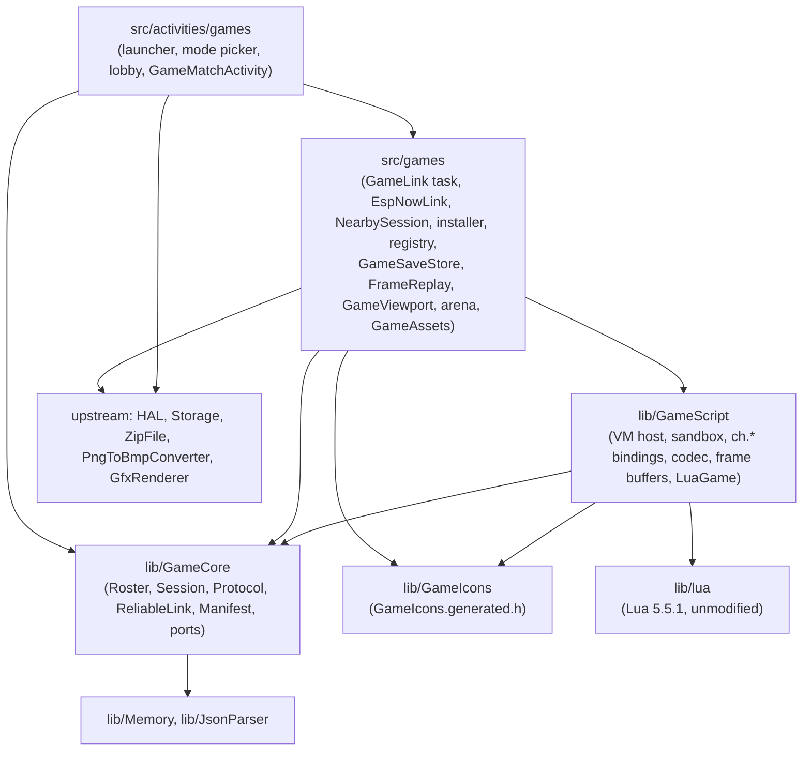
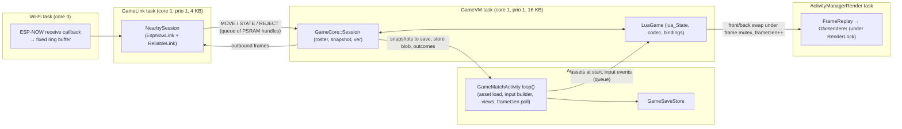

# Architecture Spine: crosshatch-player v1 game platform

## Design Paradigm

**Hexagonal host.** `lib/GameCore` is the domain: roster, session, turns, snapshots, the wire protocol, the reliable link, and manifests. It is host-testable C++20 with no device dependencies. It declares ports; everything touching Lua, the radio, the SD card, or the display is an adapter outside it.

**Reducer contract for scripts.** A game is a set of functions over one serializable `state`. Only the **authority** device runs `setup` and `apply`. Every device runs `draw` and `input`. The runtime replicates the whole state after each move, so scripts contain no radio code and one script runs in every mode.

**Built for simple games.** The engine serves turn-based pen-and-paper, board, card, dice, word, puzzle, and parlor games (AD-23). It is not a real-time or high-performance engine, and that scope is what makes the event-driven, whole-frame, e-ink-first design above sufficient.

| Layer | Lives in | May depend on |
| --- | --- | --- |
| Domain | `lib/GameCore/` | C++ standard library, `lib/Memory`, `lib/JsonParser` |
| Icon data | `lib/GameIcons/` | nothing (generated data only) |
| Script adapter | `lib/GameScript/` | `GameCore`, `GameIcons` (names), `lib/lua` |
| Engine (vendored) | `lib/lua/` | C standard library |
| Device adapters | `src/games/` | `GameCore`, `GameScript`, `GameIcons`, HAL, `Storage`, `ZipFile`, `PngToBmpConverter`, ESP-NOW, mbedTLS |
| Screens | `src/activities/games/` | `src/games/`, `GameCore`, `GfxRenderer`, `UiListActivity` / `UiAppHost` |

## Invariants & Rules



Arrows are the only allowed dependencies. `GameCore` includes no Arduino, ESP-IDF, Lua, HAL, or `src/` header. `GameScript` includes no `GfxRenderer`, HAL, or Arduino header; platform services (arena, sources, text metrics, randomness) reach it through injected ports.

### AD-1: Hexagonal host, reducer scripts [ADOPTED]

- **Binds:** all
- **Prevents:** game rules or radio logic split between C++ and Lua; a core that only runs on the device.
- **Rule:** game logic lives only in scripts. Roster, session, turn, sync, and protocol logic lives only in `GameCore`, behind the ports `IGameRules`, `ILink`, `IClock`, `IRandom`, and `ISnapshotStore`. Adapters implement ports and hold no game rules. Every `GameCore` unit has a host GoogleTest suite; link and session suites run over a `FakeLink` that drops, delays, duplicates, and reorders frames.

### AD-2: One build guard, C3-safe [ADOPTED]

- **Binds:** all
- **Prevents:** game code costing flash or RAM on C3 builds, or breaking them.
- **Rule:** `FREEINK_CAP_GAMES=1` is set for `x4pro`, `sticky`, their `-gh_release` / `-gh_release_rc` variants, and the fork-owned simulator envs only. Every include of game code in an upstream file sits inside `#if FREEINK_CAP_GAMES`. Every `.cpp` under `src/games/` and `src/activities/games/` is wrapped whole-file in `#if FREEINK_CAP_GAMES`. `lib/Game*` has no namespace-scope objects with non-trivial constructors and no static buffers over 64 B (generated `constexpr` icon data excepted). All game libraries compile, unreferenced, for `default`, `x4c`, and `papermono`. Under `SIMULATOR`, `EspNowLink` and `nearby` are compiled out and the SHA-256 helper uses OpenSSL.

### AD-3: The upstream-touch ledger is the cap [ADOPTED]

- **Binds:** all
- **Prevents:** the fork drifting back into CrossPlay's merge pain.
- **Rule:** v1 changes only the upstream files in the ledger below, plus at most 1 reserve file, which must be added to the ledger in the same PR. Each change is `#if FREEINK_CAP_GAMES`-guarded where the language allows; unguardable changes are marked as such. The ledger lives in `docs/crosshatch/upstream-touches.md`. A fork-only CI job fails a PR when a path that exists in `upstream/develop` differs between `merge-base(HEAD, upstream/develop)` and `HEAD` and is in neither the ledger nor a baseline allowlist of pre-existing fork files (`AGENTS.md`, `.gitattributes`, `.gitignore`, `.github/PULL_REQUEST_TEMPLATE.md`, the removed `CLAUDE.md`); the job fetches `upstream/develop` with full history. Anything beyond the reserve needs a spine update first.

  | # | Upstream file | Change | Guarded |
  | --- | --- | --- | --- |
  | 1 | `platformio.ini` | `FREEINK_CAP_GAMES=1` in the six x4pro/sticky envs; `--suppress=*:*/lib/lua/*` in the shared `check_flags`; `GameCore`, `GameScript`, `GameIcons`, and `lua` in the shared `lib_deps`, so every env compiles them | env-scoped + two shared lines |
  | 2 | `lib/I18n/translations/english.yaml` | `STR_GAMES_*` keys appended | append-only |
  | 3 | `test/CMakeLists.txt` | `add_subdirectory(game_core)`, `add_subdirectory(game_script)` | no |
  | 4 | `src/activities/ActivityManager.h` | `HomeMenuItem::Games`, `goToGames()` | yes |
  | 5 | `src/activities/ActivityManager.cpp` | `goHome` mapping, `goToGames()` | yes |
  | 6 | `src/activities/home/HomeActivity.h` | index mapping, `onGamesOpen()` | yes |
  | 7 | `src/activities/home/HomeActivity.cpp` | item count, switch case, label; list mode reuses an existing `UIIcon` | yes |
  | 8 | `src/components/CoverGridHomeUi.h` | tab array size | yes |
  | 9 | `src/components/CoverGridHomeUi.cpp` | Games tile drawn from a `GameIcons` bitmap | yes |

  The vendored engine is kept out of the whole-tree format check by a new `lib/lua/.clang-format` with `DisableFormat: true`, not by editing `bin/clang-format-fix`.

### AD-4: Lua 5.5.1, unmodified, 64-bit integers [ADOPTED]

- **Binds:** script-runtime, api-docs, first-party-games
- **Prevents:** a patched engine that blocks upgrades; games or saves that depend on a language level or integer width that later changes.
- **Rule:** PUC Lua 5.5.1 is vendored byte-for-byte in `lib/lua/` and compiled as C, with every `LUA_COMPAT_*` option off. A fork-owned `lib/lua/library.json` `srcFilter` excludes `lua.c`, `luac.c`, `linit.c`, `liolib.c`, `loslib.c`, `ldblib.c`, `loadlib.c`, and `lcorolib.c`; `test/game_script` builds the same source list. Games target the Lua 5.5 language (`global` is reserved; `for` control variables are read-only) with 64-bit integers; `LUA_32BITS` can only arrive with a new `api` level and a `proto` bump. `lua_newstate`'s hash seed comes from `IRandom`. Every C++ file that includes `lua.h` includes `<climits>` first and `static_assert`s `sizeof(lua_Integer) == 8`. No spike re-run gates API level 1: 5.5.1 is taken to perform at least as well as the spiked 5.4.7, and a problem found during implementation is fixed when it surfaces. Reverting the pin to 5.4.9 stays the fallback, and it is cheapest before API level 1 freezes.

### AD-5: The VM task owns the Lua state and nothing else [ADOPTED]

- **Binds:** script-runtime, multiplayer-layer
- **Prevents:** two tasks entering one `lua_State`; a teardown deadlock on `RenderLock` (pitfall 12cc816); a hung script freezing the device.
- **Rule:**
  - At most one game VM exists. A dedicated `GameVM` task (priority 1, core 1, 16 KB stack) creates, calls, and destroys it. `GameCore::Session` is confined to the same task, and `Session` and codec scratch are allocated from the VM's arena.
  - The `GameVM` task never takes `RenderLock`, never calls `ActivityManager`, and never touches `Storage`. Before the VM starts, the match activity (on the loop task) loads everything the game needs into PSRAM and hands it over through a `GameScript` port: all `*.lua` sources as one blob with a name-to-span table, converted images (AD-24), the `ch.store` blob, and any resume snapshot.
  - The `GameVM` task exchanges work through depth-bounded queues that carry handles to PSRAM buffers, not frame copies; a full input queue drops the oldest event with a log line.
  - While a callback runs, the match's `skipLoopDelay()` returns true, which keeps the CPU at full clock for the budget.
  - Stopping is cooperative: the match sets an atomic cancel flag that the count hook turns into a Lua error, and posts `Quit`. The VM task unwinds, closes the state, and signals a join semaphore. If the join has not happened 500 ms after cancel (a script stuck inside a C library call), the match **abandons** the VM once an atomic `inSwap` flag is clear: it deletes the task and frees the arena without calling `lua_close`.
  - A cancel yields the outcome `Cancelled`, which is distinct from `ScriptError` and never triggers AD-14.

### AD-6: Sandbox and budgets [ADOPTED from the spike, amended]

- **Binds:** script-runtime
- **Prevents:** a game crashing the device, starving internal RAM, or running forever.
- **Rule:**
  - Each VM's heap is one 256 KB PSRAM arena managed by a small in-tree allocator behind a counting `lua_Alloc`. `src/games` supplies the arena backend as a port. Abandoning a VM (AD-5) frees the arena in one call.
  - Every entry into the VM, including script load and setup, goes through a `lua_pcall` trampoline.
  - A sticky count hook enforces 2 M instructions per callback. A script's own `pcall` cannot swallow the budget error.
  - Libraries: base (without `load`, `loadfile`, `dofile`; `print` maps to `ch.log`), table, string, math, utf8. `require` resolves only against the source table from AD-5.
  - Every chunk is loaded from memory in text mode (`"t"`); binary chunks are rejected at install and at load.
  - `math.random` is seeded from `IRandom` (backed by `esp_random()`) when the VM is created.
  - Bindings are C-style functions. No binding holds an RAII object across a call into Lua, and no binding opens files.

### AD-7: Drawing is a display list; FrameReplay owns refresh [ADOPTED]

- **Binds:** script-runtime, first-party-games
- **Prevents:** Lua touching the framebuffer from the wrong task; lost or doubled refresh escalations; taps landing away from what was drawn; layout that differs between devices.
- **Rule:**
  - `ch.gfx.*` appends commands to a back frame buffer in PSRAM (at most 2,048 commands / 32 KB; overflow is a script error). Calling `ch.gfx` outside `draw` is a script error.
  - When `draw` returns, the VM task swaps front and back buffers under a frame mutex (setting `inSwap` for the duration) and bumps an atomic `frameGen`. The match's `loop()` polls `frameGen` and calls `requestUpdate()`. The render task takes the frame mutex only inside `render()`. Lock order is always `RenderLock`, then the frame mutex.
  - The runtime calls `draw` after every new snapshot, after every `input` call, and after hand-off or resume. There is no frame loop; `ch.timer` (AD-23) is the only time-driven trigger. A frame identical to the one on screen is not refreshed.
  - `FrameReplay` is the only escalation policy. Its inputs are the frame's hint (`fast`, `half`, `full`), a `forceFull` flag set by the match activity, and its own fast-refresh counter. Coalesced frames keep the maximum hint (`full` > `half` > `fast`). v1 refreshes whole frames.
  - Color: fills take `white`, `light`, `dark`, `black` (`light` and `dark` render as dithered fills); lines, text, icons, and images take `white` or `black`.
  - Text sizes `small`, `medium`, `large` map to built-in flash fonts only. The match passes per-size advance tables into `GameScript` at VM start, so `ch.text_width` is pure and callable in any callback. Script code never names panel sizes or firmware font IDs.
  - One `GameViewport` in `src/games` defines the script canvas (rotation, offset, the size exposed as `ch.screen`, excluded bezel insets). `FrameReplay` (logical to panel) and the input builder (panel to logical) both use it. The script owns the whole canvas; the runtime draws over it only with its own views (AD-20).

### AD-8: The game contract [ADOPTED]

- **Binds:** script-runtime, multiplayer-layer, first-party-games, api-docs
- **Prevents:** games that each invent their own lifecycle, turn signalling, or rejection handling.
- **Rule:** `main.lua` returns a table with exactly these entry points:

  | Function | Runs on | Returns |
  | --- | --- | --- |
  | `setup(ctx)` | authority | the initial `state`; `ctx = {seats = n, mode = "solo" \| "pass" \| "nearby"}` |
  | `status(state)` | authority; any device inside `draw` | `{turn = seat}` or `{over = true, winners = {seat…}}`; must be a pure function of `state` |
  | `apply(state, seat, move)` | authority | the new `state`, or `nil, reason` to reject |
  | `draw(state, seat, ui)` | every device | nothing; draws via `ch.gfx` |
  | `input(state, seat, ui, event)` | every device | a `move`, or `nil` |

  - `ui` is a table per local seat (one per seat in `pass`, one in `solo` and `nearby`), plus a separate shared table for seat 0 at game over in `pass`. The script may mutate it freely; it is never synced or saved.
  - Events delivered to `input`: `tap`, `long_press`, `swipe` (touch); `rejected` (a move was refused, in every mode; the runtime never draws the reason itself); `over` (once per local seat per round, for per-device records such as wins); `timer` (AD-23). There are no drag events.
  - While a move is awaiting its `STATE` or `REJECT`, the runtime still calls `input` but discards any move it returns.
  - Computer opponents, if a game has one, run inside `apply`.
  - The script decides turn order through `status`; the runtime enforces it (AD-11). This is a deliberate change from the brief's "runtime owns turn order".

### AD-9: The snapshot is the source of truth [ADOPTED]

- **Binds:** multiplayer-layer, script-runtime
- **Prevents:** host and guest diverging; `draw` or `input` mutating game state as a side effect; two devices disagreeing on whose turn it is.
- **Rule:** the canonical state is the encoded snapshot held by `GameCore::Session` on the authority. Each `apply` receives a fresh decode of it, and its result is re-encoded to become the new snapshot. `draw`, `input`, and `status` receive a decoded copy whose changes are discarded. The authority computes `status` after each accepted move and ships it inside `STATE`; guests gate input and the end-of-round flow on that shipped status and never call `status` for control flow.

### AD-10: One codec, one size limit, every mode [ADOPTED]

- **Binds:** multiplayer-layer, script-runtime, first-party-games
- **Prevents:** a game that works in pass-and-play and breaks in Play Nearby; a firmware update that silently corrupts saves; tooling that can't reproduce device bytes.
- **Rule:**
  - One C codec in `GameScript` encodes state, moves, and `ch.store`. It accepts nil, boolean, integer, float, string, and tables with string or integer keys: acyclic, depth at most 16, no metatables, functions, or userdata. Integral float keys are normalized to integers; other float keys and NaN keys are errors.
  - **Codec v1 bytes** (little-endian): one tag byte per value (`nil`, `false`, `true`, int, float, string, table); int is zigzag LEB128 of an i64; float is IEEE-754 binary64; string is a LEB128 length plus bytes; a table is `LEB128 narr`, `narr` values for keys `1..narr` (the longest non-nil run from 1), `LEB128 nrec`, then `nrec` key/value pairs sorted by key (integers ascending, then strings bytewise). The encoding is canonical: equal values give equal bytes.
  - Limits apply to codec output: snapshot at most **1,400 B**, move at most **256 B**, `ch.store` at most **4 KB**. They are enforced in every mode, and a breach is a script error.
  - The codec version is part of `proto`. Every persisted codec blob starts with `{magic, fileVersion, codecVersion}`; an unknown version is discarded with a log line, never decoded.
  - A Python reference codec in `scripts/` and the C codec pass the same encode and decode golden vectors in `test/game_script/`. The byte formats are recorded in `docs/crosshatch/formats.md`.

### AD-11: Roster, seats, and authority [ADOPTED]

- **Binds:** multiplayer-layer, package-install-launcher
- **Prevents:** two seat maps; a guest claiming another seat; two-player assumptions baked into the core; moves accepted out of turn.
- **Rule:** a `Roster {mode, n, localSeats, peers[seat] → link id}` is fixed before `setup` and immutable for the match, including rematches.
  - **Solo:** `n = 1`; local input is seat 1. Offered only when `seats.min == 1`.
  - **Pass:** the player picks `n` within `seats` and the host maximum. `draw` and `input` get `status.turn`, except in the hidden-game `Result` state (AD-12) and at game over (seat 0).
  - **Nearby:** the host is seat 1, and guests get seats in `JOIN` arrival order, carried in `ACCEPT`. `n` is the number of seats filled when the host starts (at least 2). The roster moves into the match with `NearbySession`.
  - The seat of a remote move comes from the peer's link identity, never from the payload.
  - A `status` naming a turn outside `1..n` is a script error. Moves are applied strictly one at a time.
  - v1 hosts support n ≤ 2; nothing in `GameCore` may assume n = 2.

### AD-12: The runtime owns the hand-off [ADOPTED from the brief, amended]

- **Binds:** multiplayer-layer
- **Prevents:** hidden information leaking through e-ink ghosting, sleep, or resume.
- **Rule:** in `pass` mode with manifest `hidden = true`:
  - After an accepted move that changes the turn seat, the match enters `Result`: `draw` gets `seat = mover`, any move `input` returns is discarded, and a runtime banner reads "Tap to pass to player N". A tap shows the blank hand-off screen with a full refresh, and a tap there draws the next seat.
  - The hand-off screen also comes before the first draw after `setup` (including Play again) and after resume.
  - The match's `onExit()`, including the sleep path, renders the blank hand-off screen and pushes it with `displayBuffer(HALF_REFRESH)`, under the `RenderLock` it already holds and without taking it again.
  - Scripts cannot draw during or suppress the hand-off. In `nearby` mode each device draws only its own seat.

### AD-13: Wire protocol [ADOPTED]

- **Binds:** multiplayer-layer
- **Prevents:** the link and the session reading one counter two ways; mismatched payload layouts; matches between devices running different game code.
- **Rule:**
  - Frame: `{magic "XH", proto u8, type u8, session u32, seq u16, ack u16, payload}`, little-endian. `GameCore::Protocol` is the only encoder and decoder of frames and payloads.
  - `seq`/`ack` belong to `ReliableLink` alone: `seq` counts reliable frames per direction, and `ack` is cumulative. `ADVERT`, `PING`, and `ACK` are unreliable and consume no `seq`. Unacked frames are resent every 400 ms; a peer silent for 10 s is dropped.
  - Payloads:

    | Type | Payload |
    | --- | --- |
    | `ADVERT` | `gameId (len8, ≤ 32 B), pkgHash[8], manifestApi u8, seatsMax u8, seatsTaken u8, hostLabel (len8, ≤ 16 B)` |
    | `JOIN` | `pkgHash[8]` |
    | `ACCEPT` | `seat u8, n u8`, sent to every guest when the host starts |
    | `MOVE` | `ver u16, move blob` |
    | `STATE` | `ver u16, turn u8 (0 when over), over u8, winners u16 bitmask, snapshot blob` |
    | `REJECT` | `ver u16, reason (len8, ≤ 64 B)` |
    | `ABORT` | `reason u8`: `left`, `script_error`, `timeout`, `full`, `version_mismatch` |
    | `PING` | empty |

  - `ver` is owned by `Session`: it increases with every snapshot for the life of the `session` id and never resets, including on rematch. `STATE` is latest-wins: the link may replace an unacked `STATE` with a newer one, and a guest ignores any `STATE` whose `ver` is not newer than its own.
  - The host draws the `session` id from `IRandom` when the lobby opens; frames with any other `session` are dropped. The host stops `ADVERT` when the match starts and answers a late `JOIN` with `ABORT(full)`.
  - Matching requires equal `proto` (which includes the codec version) and equal package hash. The firmware `api` level is not compared.
  - Only `ADVERT` is broadcast. Everything else is unicast to a peer registered on the STA interface. ESP-NOW v2, fixed channel 1, no encryption.

### AD-14: A script failure ends the session [ADOPTED]

- **Binds:** script-runtime, multiplayer-layer
- **Prevents:** half-recovered VMs and inconsistent error handling across callbacks.
- **Rule:** a `ScriptError` is any Lua error, budget breach, memory cap breach, codec limit breach, frame buffer overflow, unknown icon or image name, or invalid `status`. It ends the session: the VM is stopped (AD-5), a peer is sent `ABORT(script_error)`, the error is logged with `LOG_ERR`, and the match shows its error view: a short `tr()` message, the game name, the Lua message in small type, and a single Back control. There is no automatic retry. A `Cancelled` outcome shows nothing.

### AD-15: Package format and the one manifest parser [ADOPTED]

- **Binds:** package-install-launcher, first-party-games, api-docs
- **Prevents:** several package shapes and manifest dialects; path traversal and zip bombs; a package that installs but never lists.
- **Rule:**
  - A game is one `.cpgame` file: a zip (stored or deflate, no ZIP64) read through `lib/ZipFile`. Members are flat and whitelisted: `manifest.json`, `main.lua`, `[a-z0-9_]{1,32}.lua`, `[a-z0-9_]{1,32}.png` (non-interlaced; `icon.png` is the package icon, the rest are images for `ch.gfx.image`). Anything else, including directories, makes the package invalid.
  - Limits: package at most 256 KB, at most 32 members, each member at most 128 KB uncompressed, converted images at most 128 KB in total. The installer reads the EOCD entry count and rejects a package whose enumerated count differs; it checks each member's inflated size before extracting and verifies each CRC over the streamed output.
  - `require("name")` loads only `name.lua` from the package root.
  - `GameCore::Manifest::parse()` is the only manifest parser; the installer, registry, launcher, and lobby all call it. `Manifest::check(hostCaps)` returns `Invalid(reason)` (rejected at install), `Unavailable(reason)` (installed but not startable, e.g. `api` above the host's), or `Ok` with the modes this host can satisfy.
  - Manifest keys: `id` (matching `^[a-z0-9][a-z0-9-]{0,31}$`), `name`, `version`, `api` (integer ≥ 1), `seats {min, max}`, `modes` (non-empty, from `solo`, `pass`, `nearby`), `hidden` (default `false`), `icon` (optional library icon name, used when there is no `icon.png`). Unknown keys are ignored.

### AD-16: One installer, one registry, the SD inbox [ADOPTED]

- **Binds:** package-install-launcher
- **Prevents:** install paths that validate differently; half-installed or phantom games; reinstall deleting saves; two devices seeing different identities for the same game.
- **Rule:**
  - `GamePackageInstaller` is the only code that installs or removes games. In v1 its only entry point is the SD inbox: the launcher installs every `/games/*.cpgame` when it opens. Users put files there with the existing web file manager or USB. A web Games page is deferred; `/api/games*` is reserved for it.
  - It validates the package (AD-15), extracts to `/.games-tmp/<id>/`, converts `icon.png` to a 1-bit 64×64 `icon.bmp` and every other image to a 1-bit `<name>.bmp` at its own size with `PngToBmpConverter` (a failed conversion makes the package `Invalid`), removes any old `/.games/<id>/`, renames the new directory into place, and writes `.pkg` last as the commit marker. A leftover `/.games-tmp/` is deleted when the launcher opens.
  - `.pkg` holds `v1\n` followed by the 16 lowercase hex digits of the package hash and `\n`. The package hash is the first 8 bytes of a SHA-256 over the zip members sorted by name, each as `name \0 u32le(length) uncompressed-bytes`. `scripts/pack_game.py` computes the same value, and both pass a shared test vector. SHA-256 is reached through one helper in `src/games`.
  - The registry lists only directories under `/.games/` that have a valid `.pkg` and whose name equals `manifest.id`. There is no separate index.
  - An inbox file is deleted after a successful install. A failed file is renamed `*.cpgame.bad`, and the launcher shows the reason once.
  - Removing a game (from the launcher) deletes `/.games/<id>/` and keeps `/.games-data/<id>/`.
  - All file access goes through `Storage` / `HalFile`.

### AD-17: The runtime owns persistence [ADOPTED]

- **Binds:** script-runtime, multiplayer-layer, package-install-launcher
- **Prevents:** scripts writing arbitrary files; resume formats that differ between games; SD writes from the VM task; lost saved data when the VM stops first.
- **Rule:**
  - Scripts have no file API. `src/games/GameSaveStore` implements `ISnapshotStore` and is the only reader and writer of `/.games-data/<id>/resume.bin` and `store.bin`. It runs on the loop task and writes to a `.tmp` file, then renames.
  - `resume.bin` holds `{magic, fileVersion, codecVersion, pkgHash[8], mode, n, ver u16}` followed by the snapshot. It is written after every committed snapshot in `solo` and `pass` and deleted when the round ends. The launcher calls `GameSaveStore::peek()` to offer "Continue". A save whose package hash or codec version differs is discarded. `nearby` matches are not saved.
  - `ch.store` is one table per game per device. `get` works in every callback. `set` encodes and validates at once (AD-10) and posts the blob to a latest-wins PSRAM slot owned by the match; the store is dirty only when the bytes differ. `GameSaveStore` writes a dirty store at most every 5 s, at round end, and in the match's `onExit()` (including sleep), which is the only SD write allowed in `onExit()`. Writes made in `apply` land only on the authority.

### AD-18: Radio ownership [ADOPTED]

- **Binds:** multiplayer-layer
- **Prevents:** ESP-NOW and the web server fighting over Wi-Fi; a radio left on after a match; GameCore running on the Wi-Fi task; an upstream screen pushed over the match stalling the link.
- **Rule:**
  - One `NearbySession` owns Wi-Fi and ESP-NOW. Bring-up order: `WiFi.mode(WIFI_STA)`, set channel 1, wait for STA start, `ESP_NOW.begin`, register peers on the STA interface.
  - The ESP-NOW receive callback only copies frames into a fixed ring buffer in `EspNowLink`; it calls no `GameCore` code.
  - A dedicated `GameLink` task (priority 1, core 1, 4 KB stack) drains the ring buffer, runs `ReliableLink` timers, and exchanges session events with the `GameVM` task through queues. It keeps running whatever activity is on top (for example the upstream frontlight panel), so no `Activity::loop()` pumps the radio.
  - The lobby creates the session and passes it by move into `GameMatchActivity`'s constructor, switching with Replace; a moved-from lobby tears down nothing. It never coexists with the web server or any other Wi-Fi activity.
  - The lobby and a `nearby` match set `preventAutoSleep`.
  - Teardown never takes `RenderLock`. If internal heap does not recover after teardown, leaving the match to Home may `silentRestart()`; nothing restarts between rounds.

### AD-19: One API namespace, versioned [ADOPTED]

- **Binds:** script-runtime, api-docs, package-install-launcher
- **Prevents:** host functions scattered across globals; games silently running on a host too old for them.
- **Rule:** all host functions live under one reserved global table, `ch` (`ch.api`, `ch.screen`, `ch.gfx`, `ch.text_width`, `ch.timer`, `ch.store`, `ch.time`, `ch.log`). The API is versioned by an integer `api` level, additive only within a level; the icon set (AD-24) is part of the level. The launcher shows a package whose `api` exceeds the host's as unavailable and won't start it.

### AD-20: The match activity owns the session [ADOPTED]

- **Binds:** script-runtime, multiplayer-layer
- **Prevents:** a pushed screen starving the match; teardown order races that lose `ABORT`; two owners of the VM or the radio.
- **Rule:** one `GameMatchActivity` (built on `UiAppHost` for its chrome) owns the `GameVM` task, the `Session` inside it, the `NearbySession` and its `GameLink` task, the frame buffers, the loaded game assets, and `GameViewport`, from the first `setup` or resume until exit. Result, hand-off, pause menu, end-of-round menu, "waiting for host", "player left", and the error view are **views inside it**, never separate activities.
  - A user exit (Leave, or Back from the error or "player left" view) runs from `loop()` in a `Leaving` state: queue `ABORT(left)`, flush the link for at most 800 ms, stop the VM (AD-5), tear down the radio, then `goToGames()`.
  - A forced `onExit()` (sleep, or any Replace) takes the best-effort path under the `RenderLock` it holds: send `ABORT(left)` once without flushing, cancel then join or abandon the VM, radio off, blank screen per AD-12, flush a dirty `ch.store` (AD-17).
  - The game canvas is a declared exception to `touch-and-ui.md`: canvas taps come from `touchSnapshotFrom` through `GameViewport` and bypass the FreeInkUI interaction table, which serves only the runtime views; the exception is recorded in `docs/crosshatch/`.

### AD-21: Match lifecycle [ADOPTED]

- **Binds:** script-runtime, multiplayer-layer, package-install-launcher
- **Prevents:** each screen author inventing what Back, Home, sleep, game over, and rematch do.
- **Rule:** the match follows this state machine. From every non-terminal state, an `ABORT` or 10 s of peer silence goes to `PeerGone`, a `ScriptError` goes to `Error`, and sleep takes the forced exit (AD-20). Every other transition not shown is invalid.

  ```mermaid
  stateDiagram-v2
    [*] --> Lobby: nearby
    [*] --> HandOff: pass + hidden (new or resumed)
    [*] --> Playing: solo, open pass, nearby after lobby
    Lobby --> Playing: host starts (ACCEPT)
    Lobby --> Leaving: Cancel
    Playing --> Result: pass + hidden, turn seat changes
    Result --> HandOff: tap
    HandOff --> Playing: tap
    Playing --> Paused: Back or Home
    Result --> Paused: Back or Home
    HandOff --> Paused: Back or Home
    Paused --> Playing: Resume
    Paused --> Leaving: Leave
    Playing --> Over: shipped status over
    Over --> HandOff: Play again, pass + hidden
    Over --> Playing: Play again, otherwise
    Over --> Leaving: Leave
    Error --> Leaving: Back
    PeerGone --> Leaving: Back
    Leaving --> [*]
  ```

  - Back and Home never leave a match directly; they open the pause menu (the match overrides `handleHomeGesture()`). Resume returns to the state that was paused.
  - Entering `Over` delivers the `over` event, deletes the resume save, and flushes `ch.store`. Only the authority offers Play again; a guest's end-of-round menu shows "waiting for host" and Leave.
  - Wake from sleep always lands on Home; resume goes through the launcher's "Continue".

### AD-22: Player journey [ADOPTED]

- **Binds:** package-install-launcher, multiplayer-layer, first-party-games
- **Prevents:** a flow a child can't finish alone (the brief's restaurant test).
- **Rule:** from Home, starting a `solo` or `pass` game takes at most 3 taps: Games, the game, and a mode (the mode step is skipped when a game offers one mode). The launcher is a paged `UiListActivity` of icon and name, with "Continue" first when a save exists. No v1 flow needs text entry. Runtime views use `GameIcons`, short `tr()` text, and large touch targets.

### AD-23: Built for simple games [ADOPTED]

- **Binds:** all
- **Prevents:** the engine and its API growing toward real-time play that e-ink and a 2 M-instruction budget can't serve, at the cost of the simple games it exists for.
- **Rule:**
  - The engine's scope is turn-structured games that work with pen and paper, a board, cards, dice, or words, plus puzzles and parlor games, in the spirit of CrossPlay's catalog. Real-time, action, physics, platformer, and animation-driven games are out of scope.
  - An API addition, at any level, must serve a game in scope. An addition whose main use is real-time play (a frame loop, sprites, scrolling, drag input, sub-second timers, sound) is rejected.
  - Performance targets are stated per move (a move answers within about 1 s, AD-6), never as frame rates.
  - `ch.timer.after(ms)` is the finest time source: at least 1,000 ms, one pending timer per device (a new call replaces it; `ch.timer.cancel()` clears it). It fires a `timer` event into `input` for the local seat, or the current turn seat in `pass`. A timeout that changes the game is returned as a move and goes through `apply`, never through `status` or the clock.

### AD-24: An icon library sets the design language [ADOPTED]

- **Binds:** script-runtime, first-party-games, api-docs, package-install-launcher
- **Prevents:** every game drawing its own suits, dice, pieces, and arrows in a different style; runtime screens and games looking unrelated.
- **Rule:**
  - `lib/GameIcons` is a fork-owned, curated icon set drawn from one source: Phosphor Icons (MIT), fill weight, pinned at `@phosphor-icons/core` 2.1.1. The chosen SVGs are vendored in `assets/game-icons/` with Phosphor's license and recorded in `docs/crosshatch/`. A glyph Phosphor lacks is drawn as original work in Phosphor's fill style; icons from other libraries are not mixed in. A committed list in `assets/game-icons/` maps each crosshatch name to its source file, so a Phosphor rename or version bump never changes an API name. `scripts/gen_game_icons.py` renders each at 32 and 64 px as 1-bit bitmaps into a committed `GameIcons.generated.h`, which is never hand-edited.
  - Scripts draw icons with `ch.gfx.icon(name, x, y, size, color)`: `small` (32 px), `medium` (64 px), or `large` (128 px, the 64 px bitmap doubled). An unknown name is a script error.
  - Icon names are lowercase `snake_case` and part of the API level: a level only adds names, and never renames, removes, or redraws one into a different meaning. The v1 set covers marks, card suits, dice faces, board pieces, player markers, and common controls; the exact list is fixed in the icon library epic, which the launcher, runtime views, and Home tile need first; the API docs epic catalogs it.
  - The launcher, the runtime views, the Home cover-grid Games tile, and first-party games use the same set. A manifest may name a library icon as the game's icon instead of shipping `icon.png`.
  - Games may ship their own graphics as package images (AD-15), drawn at native size with `ch.gfx.image(name, x, y, color)`; an unknown name is a script error. Icons and images are drawn in `white` or `black` only.

## Consistency Conventions

| Concern | Convention |
| --- | --- |
| C++ naming and files | Follow upstream style: PascalCase types and files, one class per file pair; fork code only in new files under the dirs in the Structural Seed. |
| Lua API naming | `snake_case` functions, fields, and icon names; seats are 1-based integers (0 = everyone at game over in `pass`); colors, sizes, refresh modes, and event kinds are lowercase strings. |
| Input events | `{kind = "tap" \| "long_press", x, y}`, `{kind = "swipe", x, y, dir}` (start point plus `"left" \| "right" \| "up" \| "down"`), `{kind = "rejected", reason}`, `{kind = "over"}`, `{kind = "timer"}`. Edge gestures belong to the runtime and never reach scripts: Back (right-swipe from the left 25%) and Home (up-swipe from the bottom 14%) open the pause menu; Menu (down-swipe from the top) opens the device's light panel on frontlit boards. |
| Errors | C++: `bool` or enum results, no exceptions. Lua: `apply` rejects with `nil, reason`; host API misuse raises a Lua error. Runtime text goes through `tr(STR_GAMES_*)`. |
| Logging | `LOG_ERR` / `LOG_INF` / `LOG_DBG` with tags `GAME`, `LUA`, `LINK`; `ch.log` and `print` map to `LOG_INF` tagged with the game id. |
| Memory | VM arena, frame buffers, loaded game assets, and queue payloads in PSRAM; fixed-size receive buffers; `makeUniqueNoThrow` elsewhere. `lib/lua` is exempt from the 256 B locals rule because it runs only on the 16 KB `GameVM` stack. The installer streams entries (`readFileToStream`), never whole members into memory. |
| Strings and i18n | Runtime keys prefixed `STR_GAMES_`, added to `english.yaml` only; game text is the game's own. |
| Screens | Launcher and mode picker on `UiListActivity`; lobby and `GameMatchActivity` on `UiAppHost` (AD-20 exception for the canvas). |
| SD layout | `/games/` inbox, `/.games/<id>/` installs, `/.games-tmp/` staging, `/.games-data/<id>/` saves. Nothing under `/.crosspoint/`. |
| Docs | Fork docs in `docs/crosshatch/` (`upstream-touches.md`, `formats.md`, `game-api.md`, icon catalog and attributions), never in upstream docs. The game API reference is self-contained, with a LuaLS `---@meta` stub for `ch`, so both move to the starter repo unchanged. |

## Stack

| Name | Version |
| --- | --- |
| C++ / C | C++20 with `-fno-exceptions`; Lua built as C |
| Lua | 5.5.1 (PUC, vendored) |
| pioarduino platform | 55.03.311 (Arduino-ESP32 3.3.11, ESP-IDF 5.5.5), follows upstream's pin |
| PlatformIO Core | pioarduino 6.1.19 |
| ESP-NOW | v2 (1,470 B max payload, 20 peers) |
| Zip / inflate, PNG | in-tree `lib/ZipFile` + `lib/miniz`, `lib/PngToBmpConverter` |
| Icons | Phosphor Icons 2.1.1 (`@phosphor-icons/core`, MIT), fill weight |
| SHA-256 | mbedTLS (bundled with ESP-IDF 5.5) on device, OpenSSL in the simulator, behind one helper |
| Host tests | GoogleTest 1.17.0 via CMake, follows upstream's pin |

## Structural Seed

Task view of a match:



A Play Nearby turn, guest to host:

```mermaid
sequenceDiagram
  participant G as Guest (seat 2)
  participant H as Host (seat 1, authority)
  G->>G: input(state, 2, ui, tap) → move (further moves held)
  G->>H: MOVE {ver, move}
  H->>H: peer → seat 2; shipped turn == 2? apply(decode(snapshot), 2, move)
  alt accepted
    H->>H: encode → snapshot, ver+1, status
    H->>G: STATE {ver+1, turn, over, winners, snapshot}
    G->>G: draw(state, 2, ui)
  else rejected
    H->>G: REJECT {ver, reason}
    G->>G: input(state, 2, ui, {kind = "rejected"})
  end
  H->>H: draw(state, 1, ui)
```

Source tree:

```text
lib/
  lua/                    # Lua 5.5.1, unmodified; fork-owned library.json (srcFilter) and .clang-format (DisableFormat)
  GameCore/               # Roster, Session, Protocol, ReliableLink, Manifest, ports
  GameIcons/              # GameIcons.generated.h (names + 32/64 px 1-bit bitmaps)
  GameScript/             # VM host, arena allocator glue, budget hook, sandbox, ch.* bindings, codec, frame buffers, LuaGame
src/
  games/                  # GameLink task, EspNowLink, NearbySession, GamePackageInstaller, GameRegistry, GameSaveStore,
                          # GameAssets (source/image/store loader), FrameReplay, GameViewport, PSRAM arena backend, Sha256 helper
  activities/games/       # GamesLauncherActivity, GameModeActivity, GameLobbyActivity, GameMatchActivity
assets/game-icons/        # vendored Phosphor fill SVGs, name map, original additions, license
games/<id>/               # first-party game sources (manifest.json, main.lua, *.png)
scripts/pack_game.py      # games/<id>/ → <id>.cpgame, validates, prints package hash
scripts/game_codec.py     # reference codec for golden vectors and tooling
scripts/gen_game_icons.py # assets/game-icons/*.svg → lib/GameIcons/GameIcons.generated.h
test/game_core/           # host suites incl. FakeLink, protocol, manifest, hash vector
test/game_script/         # host suites incl. Lua on host, codec golden vectors, sandbox cases
docs/crosshatch/          # upstream-touches.md, formats.md, game-api.md + ch.d.lua, icon catalog
.github/workflows/        # fork-only upstream-touch ledger check (new file)
.claude/skills/run-crosshatch-player/simulator.ini   # fork-owned; simulator envs set FREEINK_CAP_GAMES
```

On the SD card:

```text
/games/*.cpgame           # install inbox; *.cpgame.bad after a failed install
/.games/<id>/             # installed package: manifest.json, *.lua, icon.bmp, <image>.bmp, .pkg
/.games-tmp/<id>/         # install staging, deleted on launcher open
/.games-data/<id>/        # resume.bin, store.bin
```

Operational envelope:

| Concern | v1 answer |
| --- | --- |
| Firmware delivery | Existing release pipeline; the six x4pro/sticky envs carry `FREEINK_CAP_GAMES`; users update through the existing OTA, SD, or web flasher paths. |
| Game delivery | `.cpgame` files. First-party games are attached to each fork release and installed through the inbox like any other game. |
| CI | The existing PR workflow builds all five envs and runs the host suites, including `test/game_core` and `test/game_script`; the fork-only job checks the upstream-touch ledger. |
| Flash budget | The whole runtime (Lua, GameCore, GameScript, GameIcons, screens) adds at most 250 KB to the x4pro image (baseline 86.3% of the app slot; Lua alone measured +124 KB; icons about 40 KB for 64 icons at two sizes). A fork-only CI job measures it as the x4pro image with `FREEINK_CAP_GAMES` on minus the same commit with it off, so upstream growth never counts against it. |
| Internal RAM | The `GameVM` (16 KB) and `GameLink` (4 KB) stacks and the Wi-Fi/ESP-NOW driver are the internal-RAM costs; everything else is in PSRAM. A `nearby` lobby refuses to open below 100 KB free internal heap. |
| Observability | Serial log (`GAME`, `LUA`, `LINK`) and the match error view; no telemetry. |
| Security | Sandboxed scripts (AD-6), text-only chunks, validated flat packages (AD-15), jailed files (AD-16, AD-17), unencrypted radio in a cooperative room (AD-13). |

## Capability → Architecture Map

| Capability / area | Lives in | Governed by |
| --- | --- | --- |
| Script runtime (sandbox, touch, drawing, refresh, timers, error isolation) | `lib/GameScript`, `lib/lua`, `src/games` (FrameReplay, GameViewport, arena, GameAssets) | AD-4 to AD-8, AD-14, AD-19, AD-23 |
| Icon library and game graphics | `lib/GameIcons`, `assets/game-icons/`, `scripts/gen_game_icons.py`, installer image conversion | AD-15, AD-16, AD-24 |
| Multiplayer layer (roster, pass-and-play, Play Nearby, hand-off, rematch) | `lib/GameCore`, `src/games` (GameLink, EspNowLink, NearbySession), `GameMatchActivity` | AD-8 to AD-13, AD-18, AD-20, AD-21 |
| Package, install, launcher | `src/games` (installer, registry), `src/activities/games`, Home hook | AD-2, AD-3, AD-15, AD-16, AD-19, AD-22 |
| Game persistence | `lib/GameCore` (ISnapshotStore), `src/games/GameSaveStore` | AD-10, AD-17, AD-21 |
| First-party games: a solo puzzle, an open-information 2P game, a hidden-information 2P game (titles chosen in the games epic) | `games/<id>/`, `scripts/pack_game.py`, release assets | AD-8, AD-10, AD-15, AD-22, AD-23, AD-24 |
| API docs for AI authors | `docs/crosshatch/game-api.md` + `ch.d.lua` + icon catalog (seeded by `game-api-seed.md`) | AD-8, AD-19, AD-23, AD-24 |
| Clean upstream merges | the upstream-touch ledger and its CI check | AD-2, AD-3 |
| The restaurant test | launcher, `GameMatchActivity` views | AD-21, AD-22 |

## Deferred

| Item | Why it can wait |
| --- | --- |
| Web Games page (upload, validate, delete) | v1 installs through the SD inbox; `/api/games*` is reserved, and adding it costs `CrossPointWebServer.cpp` plus nav pages in the ledger. |
| Dirty-region refresh; true grayscale; image scaling | Deliberate v1 trims of the brief; each is an additive `api` change within AD-23's scope. |
| `LUA_32BITS` | Changes integer width for games, the codec, and saves; needs a new `api` level and a `proto` bump. |
| `-O2` for Lua; trusted bytecode for first-party games | Tuning; bytecode needs its own trusted path, since AD-6 rejects binary chunks. |
| `coroutine` library | Not needed by v1 games; additive later. |
| More than 2 seats in the lobby and UI; simultaneous turns | The roster allows N; v1 ships 2 and sequential turns. Party games for 3 to 8 players are the first use. |
| State over 1,400 B (fragmentation) | Only if a real game hits the cap. |
| Reconnect or rejoin after a drop | v1 ends the match after 10 s of silence. |
| Save migration across package versions | v1 discards saves when the package hash changes. |
| Simulator fake link for Play Nearby | `FakeLink` host suites cover link logic; a simulator link is later tooling. |
| Aligning with upstream "web plugins" | No upstream code exists; revisit if it ships. |
| Starter repo | Post-v1; the API docs, LuaLS stub, and icon catalog are written to move there unchanged. |
| Bumps to pioarduino 55.03.312+ and GoogleTest 1.18 | Follow upstream's pins through merges. |
| Open: ESP-NOW reliability, battery cost, Sticky and mixed-device behaviour | Measure between two devices before tuning 400 ms / 10 s and the 100 KB threshold. Only one device is on hand, so this waits for the second and blocks nothing: link and session code is built against the `FakeLink` suites until then. |
| Open: internal heap after ESP-NOW teardown | Measurable on one device (radio up and down, no peer); AD-18 already bounds where a `silentRestart()` may happen. |
