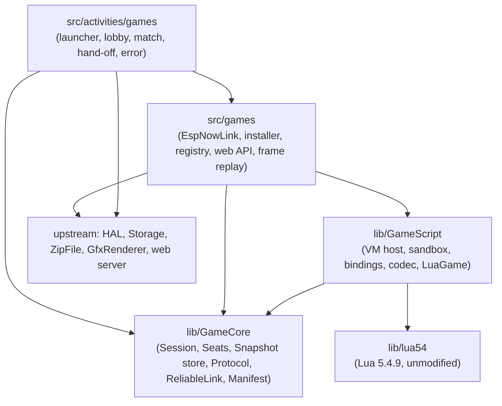
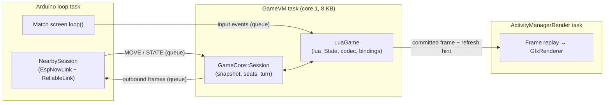
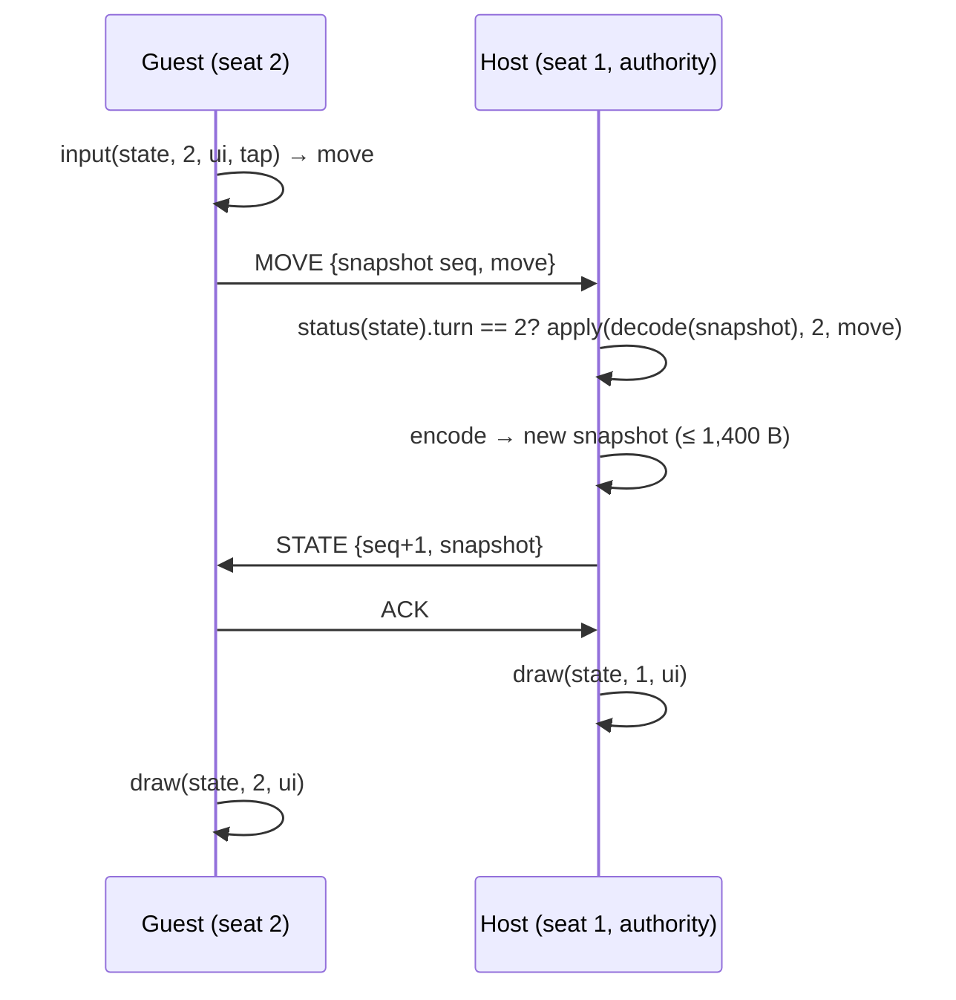

# Architecture Spine: crosshatch-player v1 game platform

## Design Paradigm

**Hexagonal host.** `lib/GameCore` is the domain: sessions, seats, turns, snapshots, the wire protocol, the reliable link, and manifests. It is pure C++20 and host-testable. It declares ports; everything touching Lua, the radio, the SD card, or the display is an adapter outside it.

**Reducer contract for scripts.** A game is a set of pure-ish functions over one serializable `state`. Only the **authority** device runs `setup` and `apply`. Every device runs `draw` and `input`. The runtime replicates the whole state after each move, so scripts contain no radio code and one script runs in every mode.

| Layer | Lives in | Depends on |
| --- | --- | --- |
| Domain | `lib/GameCore/` | C++ standard library only |
| Script adapter | `lib/GameScript/` | `GameCore`, `lib/lua54` |
| Engine (vendored) | `lib/lua54/` | C standard library |
| Device adapters | `src/games/` | `GameCore`, `GameScript`, HAL, `Storage`, `ZipFile`, ESP-NOW |
| Screens | `src/activities/games/` | `src/games/`, `GameCore`, `GfxRenderer`, `UiListActivity` / `UiAppHost` |

## Invariants & Rules



Arrows are the only allowed dependencies. `GameCore` includes no Arduino, ESP-IDF, Lua, HAL, or `src/` header. `GameScript` includes no `GfxRenderer`, HAL, or Arduino header.

### AD-1: Hexagonal host, reducer scripts [ASSUMPTION]

- **Binds:** all
- **Prevents:** game rules or radio logic split between C++ and Lua; a core that only runs on the device.
- **Rule:** game logic lives only in scripts. Session, turn, sync, and protocol logic lives only in `GameCore`, behind ports (`IGameRules`, `ILink`, `IClock`, `ISnapshotStore`). Adapters implement ports and hold no game rules. Every `GameCore` unit has a host GoogleTest suite under `test/`.

### AD-2: One build guard, C3-safe [ASSUMPTION]

- **Binds:** all
- **Prevents:** game code leaking into C3 builds, or a C3 build breaking on game code.
- **Rule:** `FREEINK_CAP_GAMES=1` is set in `platformio.ini` `build_flags` for the `x4pro` and `sticky` envs (and their release variants) only, following the `FREEINK_CAP_USB_MSC` precedent. Every include of game code in an upstream file sits inside `#if FREEINK_CAP_GAMES`. New game libraries must still compile, unreferenced, for `default`, `x4c`, and `papermono`, because the LDF chain mode follows includes without evaluating `#if`.

### AD-3: Upstream-touch cap [ASSUMPTION]

- **Binds:** all
- **Prevents:** the fork drifting back into CrossPlay's merge pain.
- **Rule:** v1 changes at most **10 upstream files**. Each change is a guarded hook of a few lines (or env-scoped `platformio.ini` lines, or `STR_GAMES_*` keys appended to `english.yaml`). Every touched upstream file is listed, with its reason, in `docs/crosshatch/upstream-touches.md`. A change that needs an 11th file needs a spine update first.

### AD-4: Lua 5.4.9, unmodified [ADOPTED engine; version is an ASSUMPTION]

- **Binds:** script-runtime, api-docs, first-party-games
- **Prevents:** a patched engine that blocks upgrades; games written for a different dialect.
- **Rule:** PUC Lua 5.4.9 is vendored byte-for-byte in `lib/lua54/` and compiled as C. `io`, `os`, `debug`, `package`, `linit`, and the standalone binaries are excluded. Games target the Lua 5.4 language. Every C++ file that includes `lua.h` includes `<climits>` first and `static_assert`s `sizeof(lua_Integer) == 8`.

### AD-5: The VM task owns the Lua state [ASSUMPTION]

- **Binds:** script-runtime
- **Prevents:** two FreeRTOS tasks entering one `lua_State`; a long callback freezing the Home and Back gestures.
- **Rule:** at most one game VM exists at a time. A dedicated `GameVM` task (8 KB stack, core 1) creates, calls, and destroys it, and no other task calls the Lua API. The loop task posts input events to a bounded queue. The render task reads only committed frames (AD-7). `GameCore::Session` is confined to the same task. To cancel a running callback, the loop task sets an atomic flag that the count hook turns into a Lua error.

### AD-6: Sandbox and budgets [ADOPTED from the spike]

- **Binds:** script-runtime
- **Prevents:** a game crashing the device, starving internal RAM, or hanging.
- **Rule:**
  - The VM heap comes from PSRAM through a per-VM counting `lua_Alloc`, capped at 256 KB.
  - Every entry into the VM, including setup and script load, goes through a `lua_pcall` trampoline.
  - A sticky count hook enforces 2 M instructions per callback. A script's own `pcall` cannot swallow the budget error.
  - Libraries: base, table, string, math. `load`, `loadfile`, and `dofile` are removed. `require` is replaced by a package-jailed loader (AD-15).
  - Bindings are C-style functions. No binding holds an RAII object across a call into Lua.

### AD-7: Drawing is a display list [ASSUMPTION]

- **Binds:** script-runtime, first-party-games
- **Prevents:** Lua touching the framebuffer from the wrong task; scripts that depend on one panel's size or font IDs.
- **Rule:** `ch.gfx.*` calls append commands to a bounded frame buffer in PSRAM. When `draw` returns, the runtime commits the frame with the script's refresh hint (`fast`, `half`, `full`). The render task replays the committed frame into `GfxRenderer` under `RenderLock`. The runtime may escalate a hint to a full refresh; it never downgrades one. Scripts get 4 color levels (`white`, `light`, `dark`, `black`), named font sizes (`small`, `medium`, `large`), and logical portrait coordinates from `ch.screen`. Script code never hard-codes panel size or firmware font IDs.

### AD-8: The game contract [ASSUMPTION]

- **Binds:** script-runtime, multiplayer-layer, first-party-games, api-docs
- **Prevents:** games that each invent their own lifecycle or turn signalling.
- **Rule:** `main.lua` returns a table with exactly these entry points:

  | Function | Runs on | Returns |
  | --- | --- | --- |
  | `setup(ctx)` | authority | the initial `state` |
  | `status(state)` | every device | `{turn = seat}` or `{over = true, winners = {seat…}}` |
  | `apply(state, seat, move)` | authority | the new `state`, or `nil, reason` to reject |
  | `draw(state, seat, ui)` | every device | nothing; draws via `ch.gfx` |
  | `input(state, seat, ui, event)` | every device | a `move`, or `nil` |

  `ui` is a per-device table the script may mutate freely. It is never synced or saved. Computer opponents, if a game has one, run inside `apply`.

### AD-9: The snapshot is the source of truth [ASSUMPTION]

- **Binds:** multiplayer-layer, script-runtime
- **Prevents:** host and guest diverging; `draw` or `input` mutating game state as a side effect.
- **Rule:** the canonical state is the encoded snapshot held by `GameCore::Session`. Each `apply` receives a fresh decode of it, and its result is re-encoded to become the new snapshot. `draw`, `input`, and `status` receive a decoded copy; changes a script makes to that copy are discarded. Only the authority produces snapshots; other devices only receive them.

### AD-10: One codec, one size limit, every mode [ASSUMPTION]

- **Binds:** multiplayer-layer, script-runtime, first-party-games
- **Prevents:** a game that works in pass-and-play and breaks in Play Nearby.
- **Rule:** one C codec in `GameScript` encodes state, moves, and `ch.store`. It accepts nil, boolean, integer, float, string, and tables with string or integer keys: acyclic, depth at most 16, no metatables, functions, or userdata. A snapshot is at most **1,400 B** and a move at most **256 B**. Both limits are enforced in every mode, including solo and pass, and a breach is a script error (AD-14).

### AD-11: Seats, modes, and authority [ASSUMPTION]

- **Binds:** multiplayer-layer, package-install-launcher
- **Prevents:** two-player assumptions baked into the core; moves accepted out of turn.
- **Rule:** seats are integers `1..N`, where the manifest's `seats.min` and `seats.max` bound N (v1 ships N ≤ 2; nothing in `GameCore` may assume N = 2). Modes are `solo`, `pass`, and `nearby`. The authority is the local device in `solo` and `pass`, and the host in `nearby`; the host is seat 1. The runtime accepts a move only from the seat that `status(state).turn` names, and it applies moves strictly one at a time.

### AD-12: The runtime owns the hand-off [ADOPTED from the brief]

- **Binds:** multiplayer-layer
- **Prevents:** hidden information leaking through e-ink ghosting.
- **Rule:** in `pass` mode, when the manifest sets `hidden = true` and the turn seat changes, the runtime shows its hand-off screen with a full refresh before it draws the next seat. Scripts cannot draw during it or suppress it. In `nearby` mode, each device draws only its own seat.

### AD-13: Wire protocol [ASSUMPTION]

- **Binds:** multiplayer-layer
- **Prevents:** incompatible framing between the link, lobby, and session code; matches between devices running different game code.
- **Rule:**
  - Every ESP-NOW frame is `{magic "XH", proto u8, type u8, session u32, seq u16, ack u16, payload}`, little-endian, codec in `GameCore`.
  - Types: `ADVERT`, `JOIN`, `ACCEPT`, `MOVE`, `STATE`, `ACK`, `ABORT`, `PING`.
  - A guest sends `MOVE` tagged with the snapshot seq it saw. The host rejects stale or out-of-turn moves and broadcasts `STATE` after each accepted move. Guests never predict.
  - Unacked frames are resent every 400 ms; a peer silent for 10 s is dropped and the match ends.
  - The lobby matches only on equal `proto`, `api`, and package hash.
  - ESP-NOW v2 on fixed channel 1, adverts by broadcast, no encryption.

### AD-14: A script failure ends the session [ASSUMPTION]

- **Binds:** script-runtime, multiplayer-layer
- **Prevents:** half-recovered VMs and inconsistent error handling across callbacks.
- **Rule:** any Lua error, budget breach, memory cap breach, or codec limit breach ends the session. The runtime destroys the VM, sends `ABORT` to a peer, logs with `LOG_ERR`, and shows its error screen with the game name and the Lua message. There is no automatic retry.

### AD-15: Package format [ASSUMPTION]

- **Binds:** package-install-launcher, first-party-games, api-docs
- **Prevents:** several package shapes and manifest dialects.
- **Rule:** a game is one `.cpgame` file, a zip (stored or deflate) read through `lib/ZipFile`. It holds `manifest.json` and `main.lua`, plus optional `*.lua` modules loadable only through the package-jailed `require`, and an optional `icon.png`. The manifest declares `id` (matching `^[a-z0-9][a-z0-9-]{0,31}$`), `name`, `version`, `api`, `seats {min, max}`, `modes`, and `hidden`. Unknown manifest keys are ignored.

### AD-16: One installer, one registry [ASSUMPTION]

- **Binds:** package-install-launcher
- **Prevents:** two install paths that validate differently; half-installed games; reinstall deleting saves.
- **Rule:**
  - `GamePackageInstaller` is the only code that installs or removes games. The web Games page (`/api/games`, `/api/games/upload`, `/api/games/delete`, modeled on the fonts routes) and the launcher's SD inbox (`/games/*.cpgame`) both call it.
  - It validates the package, extracts to a temp dir, and renames it to `/.games/<id>/`, replacing an older version. It records the first 8 bytes of the package's SHA-256 as the package hash.
  - The registry is a scan of `/.games/*/manifest.json`; there is no separate index.
  - Game data lives in `/.games-data/<id>/`, outside the install dir.
  - All file access goes through `Storage` / `HalFile`.

### AD-17: The runtime owns persistence [ASSUMPTION]

- **Binds:** script-runtime, multiplayer-layer
- **Prevents:** scripts writing arbitrary files; resume formats that differ between games.
- **Rule:** scripts have no file API. The runtime auto-saves `solo` and `pass` sessions (snapshot, seats, mode, package hash) to `/.games-data/<id>/` and offers resume. It discards a save whose package hash differs. `ch.store` is one table per game (codec as AD-10, at most 4 KB), for things like high scores. `nearby` matches are not saved.

### AD-18: Radio ownership [ASSUMPTION]

- **Binds:** multiplayer-layer
- **Prevents:** ESP-NOW and the web server fighting over Wi-Fi; a radio left on after a match.
- **Rule:** one `NearbySession` object owns Wi-Fi and ESP-NOW for a match. The lobby creates it and hands it to the match screen; it tears down when that screen exits. It never coexists with the web server or any other Wi-Fi activity. A `nearby` match sets `preventAutoSleep`. Teardown never takes `RenderLock`.

### AD-19: One API namespace, versioned [ASSUMPTION]

- **Binds:** script-runtime, api-docs, package-install-launcher
- **Prevents:** host functions scattered across globals; games silently running on a host too old for them.
- **Rule:** all host functions live under one reserved global table, `ch` (`ch.api`, `ch.gfx`, `ch.store`, `ch.time`, `ch.log`, `ch.screen`). The API is versioned by an integer `api` level, additive only within a level. The launcher shows a package whose `api` exceeds the host's as unavailable and won't start it.

## Consistency Conventions

| Concern | Convention |
| --- | --- |
| C++ naming and files | Follow upstream style: PascalCase types and files, one class per file pair, fork code only in new files under the dirs in the Structural Seed. |
| Lua API naming | `snake_case` functions and fields; seats are 1-based integers; colors, fonts, refresh modes, and event kinds are lowercase strings. |
| Input events | `{kind = "tap" \| "long_press" \| "swipe", x, y, dir}`, built from the FreeInkUI `InputSnapshot`. Back, Home, and Menu edge gestures belong to the runtime and never reach scripts. |
| Errors | C++: `bool` or enum returns, no exceptions. Lua: `apply` rejects with `nil, reason`; host API misuse raises a Lua error. User-facing error text goes through `tr(STR_GAMES_*)`. |
| Logging | `LOG_ERR` / `LOG_INF` / `LOG_DBG` with tags `GAME`, `LUA`, `LINK`; `ch.log` maps to `LOG_INF` tagged with the game id. |
| Memory | VM heap, frame buffer, and zip scratch in PSRAM via `HalMemory` / capped allocators; fixed-size receive buffers in `GameCore`; `makeUniqueNoThrow` for everything else. |
| Strings and i18n | Runtime screens use `tr()` with keys prefixed `STR_GAMES_`; game text is the game's own and is not translated by the runtime. |
| Screens | Launcher and mode picker build on `UiListActivity`; the lobby, match, hand-off, and error screens build on `UiAppHost` (per `docs/contributing/touch-and-ui.md`). |
| Docs | Fork docs in `docs/crosshatch/`; the game-author API reference is self-contained so it can move to the starter repo unchanged. |

## Stack

| Name | Version |
| --- | --- |
| C++ / C | C++20 with `-fno-exceptions`; Lua built as C |
| Lua | 5.4.9 (PUC, vendored) |
| pioarduino platform | 55.03.311 (Arduino-ESP32 3.3.11, ESP-IDF 5.5.5) |
| PlatformIO Core | pioarduino 6.1.19 |
| ESP-NOW | v2 (1,470 B max payload, 20 peers) |
| Zip / inflate | in-tree `lib/ZipFile` + `lib/miniz` |
| Host tests | GoogleTest 1.17.0 via CMake |

## Structural Seed



A Play Nearby turn, guest to host:



```text
lib/
  lua54/                  # Lua 5.4.9, unmodified
  GameCore/               # Session, Seats, SnapshotStore port, Protocol, ReliableLink, Manifest
  GameScript/             # VM host, allocator, budget hook, sandbox, ch.* bindings, codec, LuaGame, frame buffer
src/
  games/                  # EspNowLink, NearbySession, GamePackageInstaller, GameRegistry, GamesWebApi, FrameReplay
  activities/games/       # launcher, mode picker, lobby, match, hand-off, error screens
  network/html/games.html # web Games page (generated header via existing pre-script)
games/<id>/               # first-party game sources (manifest.json, main.lua, icon.png)
scripts/pack_game.py      # games/<id>/ → <id>.cpgame
test/game_core/, test/game_script/   # host GoogleTest suites (GameScript suite builds Lua on host)
docs/crosshatch/          # upstream-touches.md, game-api.md
```

On device (SD card):

```text
/games/*.cpgame           # install inbox (web file manager uploads land here)
/.games/<id>/             # installed package: manifest.json, *.lua, icon, .pkg (hash)
/.games-data/<id>/        # resume save, ch.store
```

Operational envelope:

| Concern | v1 answer |
| --- | --- |
| Firmware delivery | Existing release pipeline: the `x4pro` and `sticky` envs and their `-gh_release*` variants carry `FREEINK_CAP_GAMES`; users update through the existing OTA, SD, or web flasher paths. |
| Game delivery | `.cpgame` files, uploaded over the existing web server; no store, gallery, or network fetch. |
| CI | The existing PR workflow builds all five envs and runs the host suites, including `test/game_core` and `test/game_script`. |
| Observability | Serial log (`GAME`, `LUA`, `LINK` tags) and the runtime error screen; no telemetry. |
| Security | Sandboxed scripts (AD-6), jailed files (AD-16, AD-17), unencrypted radio in a cooperative room (AD-13). |

## Capability → Architecture Map

| Capability / area | Lives in | Governed by |
| --- | --- | --- |
| Script runtime (sandbox, touch, drawing, refresh, error isolation) | `lib/GameScript`, `lib/lua54`, `src/activities/games` | AD-4 to AD-8, AD-14, AD-19 |
| Multiplayer layer (seats, pass-and-play, Play Nearby, hand-off) | `lib/GameCore`, `src/games` (EspNowLink, NearbySession) | AD-8 to AD-13, AD-18 |
| Package, install, launcher | `src/games` (installer, registry, web API), `src/activities/games` | AD-2, AD-3, AD-15, AD-16, AD-19 |
| Game persistence | `lib/GameCore` (SnapshotStore port), `src/games` | AD-10, AD-17 |
| First-party games (solo puzzle, open 2P, hidden 2P) | `games/<id>/`, `scripts/pack_game.py` | AD-8, AD-10, AD-15 |
| API docs for AI authors | `docs/crosshatch/game-api.md` (seeded by `game-api-seed.md`) | AD-8, AD-19 |
| Clean upstream merges | the upstream-touch ledger | AD-2, AD-3 |

## Deferred

| Item | Why it can wait |
| --- | --- |
| Lua 5.5.1 | 5.4.9 matches the spiked API; re-run the spike harness before switching. |
| `LUA_32BITS`, `-O2` for Lua, bytecode precompile | Tuning; each needs one measurement (spike follow-ups). |
| Image assets beyond the icon, grayscale bitmap drawing | No v1 first-party game needs it yet; add as an additive `api` change. |
| More than 2 seats in the lobby and UI; simultaneous turns | The seat model allows N; v1 ships 2 and sequential turns. |
| State over 1,400 B (fragmentation) | Only if a real game hits the cap. |
| Reconnect or rejoin after a drop | v1 ends the match after 10 s of silence. |
| Save migration across package versions | v1 discards saves when the hash changes. |
| Simulator fake link for Play Nearby | `GameCore` host tests cover link logic; a simulator link is later tooling. |
| Aligning with upstream "web plugins" | No upstream code exists; revisit if it ships. |
| Starter repo | Post-v1; the API docs are written to move there unchanged. |
| Open: silentRestart after a match | Measure internal heap after ESP-NOW teardown in the radio epic. |
| Open: where the Games entry lives | A Home menu item costs about 6 of the 10 upstream files; decide in the launcher epic. |
| Open: ESP-NOW reliability and battery | Measure between two devices before tuning 400 ms / 10 s. |
